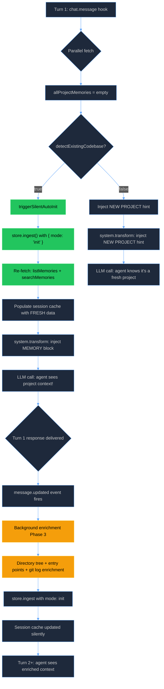
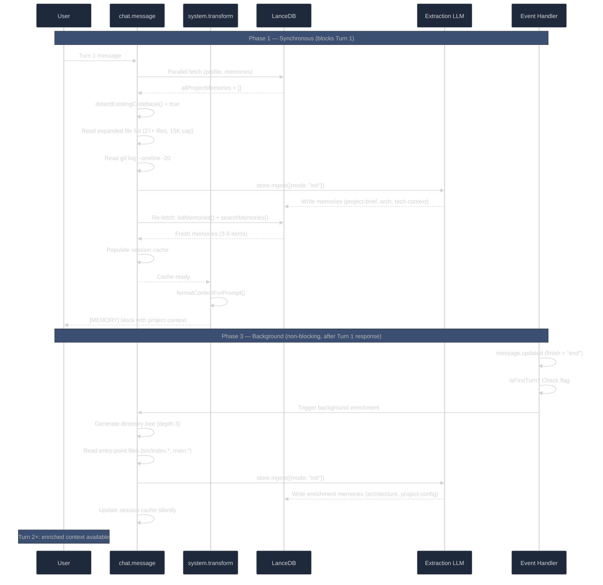
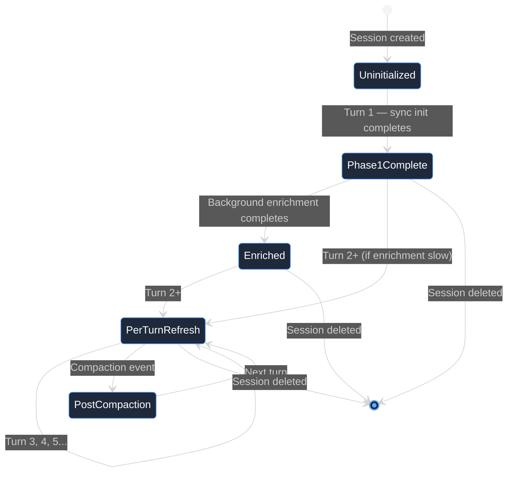

# Auto-Init Enrichment — Design Document

**Feature**: Fix broken auto-initialization and enrich first-session project understanding  
**Issue**: #114 (auto-init extraction uses wrong mode + results invisible on Turn 1)  
**Branch**: `feat/114-auto-init-enrichment`  
**Status**: IMPLEMENTED — All 5 phases complete  
**Created**: March 4, 2026  
**Completed**: March 7, 2026  
**Target Release**: v0.5.0  
**Actual Duration**: ~12 hours across 5 phases (includes E2E debugging for non-function export crash and codexfi.jsonc deletion issue)  

---

## EXECUTIVE SUMMARY

### The Problem

When a user opens a new project for the first time, codexfi's auto-initialization system is supposed to read project files (README, package.json, etc.), extract structured memories (project-brief, architecture, tech-context), and make them available in the `[MEMORY]` block so the agent has project context from Turn 1.

**This is completely broken.** Two bugs and two gaps combine to make auto-init functionally useless:

1. **Bug 1 — Wrong extraction mode**: `triggerSilentAutoInit()` calls `store.ingest()` without `{ mode: "init" }` (`index.ts:144`), so the `INIT_EXTRACTION_SYSTEM` prompt — which mandates a `project-brief` and extracts file-oriented knowledge — is **dead code**. Project files are instead processed through the conversation-oriented `EXTRACTION_SYSTEM` prompt, which expects dialogue and produces lower-quality results.

2. **Bug 2 — Results invisible on Turn 1**: The Turn 1 flow fetches memories into `allProjectMemories` at line 536 (returns `[]` for a new project), then triggers auto-init at line 543 which writes new memories to the DB. But the session cache at line 586 is populated from the **stale empty** `allProjectMemories` — the freshly-written memories are never re-fetched. The agent sees an empty `[MEMORY]` block on its first response.

3. **Gap 3 — Too shallow**: Only 10 hardcoded files are read (`INIT_FILES`, `index.ts:95-106`) with a 7,000 character total cap. Missing: CI configs, Makefile, Dockerfile, CONTRIBUTING.md, AGENTS.md, CLAUDE.md, deno.json, linter configs, monorepo workspace files, and git history — all of which provide critical project context.

4. **Gap 4 — No fresh-project detection**: When `detectExistingCodebase()` returns `false` (empty directory), the agent receives no hint about the project state. A lightweight `[MEMORY - NEW PROJECT]` system prompt hint would set expectations.

### The Solution

A 5-phase fix that repairs both bugs, enriches the init payload, adds background enrichment, and validates everything with thorough tests:

| Phase | What | Blocking? | Duration |
|-------|------|-----------|----------|
| Phase 1 | Fix Bug 1 (wrong mode) + Bug 2 (stale cache) | Yes | 1-2 hours |
| Phase 2 | Expand init file list + add git log context | Yes (Turn 1) | 2-3 hours |
| Phase 3 | Background enrichment (directory tree + entry points) | No (fires after Turn 1 response) | 2-3 hours |
| Phase 4 | Fresh-project detection hint | No | 30 min |
| Phase 5 | Testing — unit + E2E validation | Yes | 2-3 hours |

### Why This Works

| Property | Before (v0.4.7) | After (v0.5.0) |
|----------|-----------------|-----------------|
| Extraction prompt for init | `EXTRACTION_SYSTEM` (conversation-oriented) | `INIT_EXTRACTION_SYSTEM` (file-oriented, mandates project-brief) |
| Turn 1 `[MEMORY]` for new project | Empty `[]` | Populated with project-brief + architecture + tech-context |
| Files read during init | 10 files, 7K chars total | 28 files, 15K chars total + git log |
| Background enrichment | None | Directory tree + entry-point analysis (non-blocking, after Turn 1) |
| Fresh project hint | None | `[MEMORY - NEW PROJECT]` in system prompt |
| E2E test coverage for auto-init | Scenario 06 (basic, doesn't verify Turn 1 visibility) | Scenario 06 (updated) + Scenario 13 (new: Turn 1 visibility + enrichment) |

---

## CURRENT STATE — CODE REFERENCES

All line numbers verified against `main` HEAD `cc2584c`.

### Bug 1: Wrong Extraction Mode

**`plugin/src/index.ts:110-149` — `triggerSilentAutoInit()`**

```typescript
// index.ts:144-147 — THE BUG: no { mode: "init" }
const results = await store.ingest(
    [{ role: "user", content: sanitized }],
    tags.project,
    // ← Missing: { mode: "init" }
);
```

Without `mode: "init"`, `store.ingest()` defaults to `"normal"` mode at `store.ts:308`:

```typescript
// store.ts:308
const mode = options.mode ?? "normal";
```

Which routes to the wrong prompt in `extractor.ts:361-369`:

```typescript
// extractor.ts:361-369 — mode dispatch
switch (mode) {
    case "init":
        raw = await callLlm(INIT_EXTRACTION_SYSTEM, ...);  // ← NEVER REACHED from auto-init
        break;
    // ...
    default:
        raw = await callLlm(EXTRACTION_SYSTEM, ...);  // ← This runs instead
        break;
}
```

**Impact**: The `INIT_EXTRACTION_SYSTEM` prompt (`prompts.ts:78-102`) mandates a `project-brief` and is designed for file-based extraction. The `EXTRACTION_SYSTEM` prompt (`prompts.ts:8-65`) expects conversation dialogue. Project files through the wrong prompt produce vague, low-quality memories and often skip `project-brief` entirely.

### Bug 2: Results Invisible on Turn 1

**`plugin/src/index.ts:526-593` — Turn 1 flow**

```
Line 528: Parallel fetch → [profile, userSearch, projectMemoriesList, projectSearch]
Line 536: allProjectMemories = projectMemoriesList.memories → [] (empty for new project)
Line 541: if (allProjectMemories.length === 0)
Line 542:   if (detectExistingCodebase(directory))
Line 543:     await triggerSilentAutoInit() → writes to DB, but no re-fetch
Line 550: for (const m of allProjectMemories) → iterates EMPTY array
Line 586: setSessionCache() → cache has zero project memories
```

The problem: `allProjectMemories` is declared as `const` at line 536, populated from the parallel fetch (which returns `[]` for a new project). After `triggerSilentAutoInit()` writes memories to the DB at line 543, the code continues using the stale empty `allProjectMemories` to populate the session cache at line 586. The freshly-written memories exist in LanceDB but are never loaded into the cache.

### Gap 3: Shallow File List

**`plugin/src/index.ts:95-106` — `INIT_FILES`**

```typescript
const INIT_FILES = [
    { name: "README.md",           maxChars: 3000 },
    { name: "README.rst",          maxChars: 3000 },
    { name: "package.json",        maxChars: 2000 },
    { name: "Cargo.toml",          maxChars: 2000 },
    { name: "go.mod",              maxChars: 1000 },
    { name: "pyproject.toml",      maxChars: 2000 },
    { name: "docker-compose.yml",  maxChars: 1500 },
    { name: "docker-compose.yaml", maxChars: 1500 },
    { name: "tsconfig.json",       maxChars: 1000 },
    { name: ".env.example",        maxChars: 500  },
];
```

**Missing files** that provide critical project context:

| File | What it tells the agent |
|------|------------------------|
| `Makefile` | Build/test/deploy commands |
| `Dockerfile` | Runtime environment, base images |
| `.github/workflows/*.yml` | CI pipeline, test commands |
| `CONTRIBUTING.md` | Code conventions, PR process |
| `AGENTS.md` / `CLAUDE.md` | AI agent instructions |
| `deno.json` / `deno.jsonc` | Deno project config |
| `.eslintrc*` / `biome.json` | Linter configuration |
| `pnpm-workspace.yaml` / `lerna.json` | Monorepo structure |
| `turbo.json` | Turborepo pipeline |
| `nx.json` | Nx workspace config |

**`plugin/src/index.ts:108` — INIT_TOTAL_CHAR_CAP**

```typescript
const INIT_TOTAL_CHAR_CAP = 7000;
```

7K chars is very limiting. Increasing to 15K adds ~200ms to extraction (still well within acceptable latency) and dramatically improves context quality.

### Gap 4: No Fresh-Project Detection

**`plugin/src/index.ts:75-91` — `detectExistingCodebase()`**

Returns `false` for empty directories but provides no system prompt hint. The agent sees an empty `[MEMORY]` block with no explanation.

**Pattern to follow**: `disabled-warning.ts:17-49` — `buildDisabledWarning()` builds a multi-line string pushed to `output.system`. The fresh-project hint should follow this same pattern.

### Key Supporting Code

| File | Lines | Purpose |
|------|-------|---------|
| `plugin/src/store.ts:302-310` | `ingest()` | Accepts `IngestOptions` with optional `mode` |
| `plugin/src/extractor.ts:336-371` | `extractMemories()` | Mode dispatch to different prompts |
| `plugin/src/prompts.ts:78-102` | `INIT_EXTRACTION_SYSTEM` | File-oriented prompt (dead code until Bug 1 fixed) |
| `plugin/src/services/context.ts:47-133` | `formatContextForPrompt()` | Builds `[MEMORY]` block from structured sections |
| `plugin/src/services/context.ts:131` | Empty check | Returns `""` if only header (no content) |
| `plugin/src/services/auto-save.ts:65-117` | `createAutoSaveHook()` | Turn counting, extraction cooldown |
| `plugin/src/services/privacy.ts:19-44` | `stripPrivateContent()` | Must handle new file types and git log |
| `plugin/src/services/compaction.ts` | Aging rules | Init memories must not be compacted prematurely |
| `plugin/src/plugin-config.ts:66-76` | `DEFAULTS` | Config values; may need new options |
| `plugin/src/index.ts:935-1009` | Event handler | `message.updated` → potential Phase 3 trigger |

---

## ARCHITECTURE

### Current Auto-Init Flow (Broken)

```
┌─────────────────────────────────────────────────────────────────────────────┐
│                            Turn 1 — New Project                             │
├─────────────────────────────────────────────────────────────────────────────┤
│                                                                             │
│   1. chat.message hook fires                                                │
│      ├─ Parallel fetch: [profile, userSearch, projectList, projectSearch]    │
│      └─ allProjectMemories = [] (empty — new project)                       │
│                                                                             │
│   2. Auto-init triggered (line 541-546)                                     │
│      ├─ detectExistingCodebase() → true                                     │
│      ├─ triggerSilentAutoInit()                                             │
│      │   ├─ Read 10 files (7K char cap)                                     │
│      │   ├─ store.ingest() WITHOUT { mode: "init" }  ← BUG 1               │
│      │   └─ Memories written to LanceDB                                     │
│      └─ allProjectMemories still = [] (never re-fetched)  ← BUG 2          │
│                                                                             │
│   3. Cache populated from stale data (line 586-593)                         │
│      ├─ structuredSections = {} (empty)                                     │
│      └─ setSessionCache()                                                   │
│                                                                             │
│   4. system.transform hook fires                                            │
│      ├─ formatContextForPrompt() with empty cache                           │
│      └─ [MEMORY] block = "" (empty string, line 131)                        │
│                                                                             │
│   5. LLM call → agent sees NO project context                               │
│                                                                             │
│   Result: Auto-init memories exist in DB but agent never sees them          │
│           until Turn 2 (per-turn refresh picks them up)                     │
│                                                                             │
└─────────────────────────────────────────────────────────────────────────────┘
```

### Fixed Auto-Init Flow (v0.5.0)



### Data Flow — Two-Phase Init



### Session Cache State Machine



---

## IMPLEMENTATION PHASES

### PHASE 1: Fix Bug 1 + Bug 2 (Critical Path)

**Goal**: Make auto-init use the correct extraction prompt and ensure results are visible on Turn 1  
**Duration**: 1-2 hours  
**Dependencies**: None  
**Status**: COMPLETE

#### Deliverables

- [x] `plugin/src/index.ts:144` — Add `{ mode: "init" }` to `store.ingest()` call
- [x] `plugin/src/index.ts:536-593` — Re-fetch memories after auto-init, update cache

#### Fix 1: Add `{ mode: "init" }` to triggerSilentAutoInit()

**File**: `plugin/src/index.ts:144-147`

**Before** (line 144):
```typescript
const results = await store.ingest(
    [{ role: "user", content: sanitized }],
    tags.project,
);
```

**After** (line 144):
```typescript
log("auto-init: using init mode");
const results = await store.ingest(
    [{ role: "user", content: sanitized }],
    tags.project,
    { mode: "init" },
);
```

**New log message**: `"auto-init: using init mode"` — emitted before the ingest call so E2E tests can verify Bug 1 is fixed (correct extraction mode used).

This routes extraction through `INIT_EXTRACTION_SYSTEM` (`prompts.ts:78-102`) which:
- Mandates exactly ONE `project-brief`
- Extracts `architecture`, `tech-context`, `project-config`, `product-context`
- Is designed for raw file content, not conversation dialogue

#### Fix 2: Re-fetch memories after auto-init

**File**: `plugin/src/index.ts:536-593`

The Turn 1 flow at lines 526-593 needs to re-fetch memories after `triggerSilentAutoInit()` writes them to the DB. Change `const allProjectMemories` to `let` and add a re-fetch block after auto-init completes.

**Before** (lines 536-547):
```typescript
const allProjectMemories = projectMemoriesList.success
    ? projectMemoriesList.memories
    : [];

// ── Auto-init: no project memory yet ────────────────────────
if (allProjectMemories.length === 0) {
    if (detectExistingCodebase(directory)) {
        await triggerSilentAutoInit(directory, tags).catch(
            (err) => log("auto-init: failed", { error: String(err) })
        );
    }
}
```

**After**:
```typescript
let allProjectMemories = projectMemoriesList.success
    ? projectMemoriesList.memories
    : [];

// ── Auto-init: no project memory yet ────────────────────────
if (allProjectMemories.length === 0) {
    if (detectExistingCodebase(directory)) {
        await triggerSilentAutoInit(directory, tags).catch(
            (err) => log("auto-init: failed", { error: String(err) })
        );

        // Re-fetch freshly-written memories so Turn 1 sees them
        const [freshList, freshSearch] = await Promise.all([
            listMemories(tags.project, PLUGIN_CONFIG.maxStructuredMemories),
            searchMemories(userMessage, tags.project, 0.15),
        ]);

        if (freshList.success && freshList.memories.length > 0) {
            allProjectMemories = freshList.memories;
            log("auto-init: re-fetched memories for Turn 1", {
                count: allProjectMemories.length,
            });
        }

        // Update project semantic results with fresh search
        if (freshSearch.results) {
            projectSearch = freshSearch;
        }
        // NOTE: Design doc originally had `freshSearch.success` but searchMemories()
        // returns { results: Array } — no `success` field. Fixed to `.results`.
        // See IMPLEMENTATION DEVIATIONS section.
    }
}
```

**Note**: `projectSearch` (line 532) also needs to change from `const` to `let` since we reassign it after the fresh search. Currently it's part of the destructured `const` at line 528. Refactor the destructuring to allow reassignment:

**Before** (line 528):
```typescript
const [profileResult, userSearch, projectMemoriesList, projectSearch] = await Promise.all([
```

**After** (line 528):
```typescript
const [profileResult, userSearch, projectMemoriesList, initialProjectSearch] = await Promise.all([
```

Then at line 578 (building `projectResults`), use a local `let`:

```typescript
let projectSearchFinal = initialProjectSearch;
// ... (after auto-init re-fetch, update projectSearchFinal if freshSearch succeeded)

const projectResults: MemoriesResponseMinimal = {
    results: (projectSearchFinal.results || []).map((r) => ({
        ...r,
        memory: r.memory,
    })),
};
```

#### Alternatives Considered for Re-Fetch Strategy

Three approaches were evaluated for making auto-init results visible on Turn 1:

| Approach | Description | Pros | Cons |
|---|---|---|---|
| **(A) Rename + re-fetch** (chosen) | Rename `projectSearch` → `initialProjectSearch`, re-fetch into `freshList`/`freshSearch` after auto-init, use fresh data downstream | Minimal code change; only the auto-init branch pays the re-fetch cost; clear variable naming separates stale from fresh | Requires renaming one destructured variable; adds 2 new variable names |
| **(B) Re-run entire parallel fetch** | After auto-init, re-execute the full `Promise.all([listProfile, searchUser, listProject, searchProject])` | Simplest conceptually — "just try again" | Wastes 2 unnecessary API calls (profile + user search are unchanged); adds ~400ms latency for no benefit; re-fetching user memories is actively wrong (they haven't changed) |
| **(C) Mutate in-place** | Change `const allProjectMemories` to `let`, push new memories directly from `triggerSilentAutoInit`'s return value | Avoids re-fetch entirely; fastest | Breaks separation of concerns — `triggerSilentAutoInit` would need to return extracted memories in a different format; semantic search results (`projectSearch`) would still be empty; the `allProjectMemories` array format differs from what `listMemories` returns |

**Decision**: **(A)** was chosen because it's the smallest change that correctly refreshes both the list and search results. The 200ms cost of 2 parallel DB calls (not API calls — these are local LanceDB queries) is negligible relative to the 2-4s extraction LLM call that precedes it.

#### Success Criteria

- `store.ingest()` in `triggerSilentAutoInit()` uses `{ mode: "init" }`
- After auto-init, memories are re-fetched and populate the session cache
- Turn 1 `[MEMORY]` block contains `project-brief` for a new project
- Plugin builds: `cd plugin && ~/.bun/bin/bun run build`
- All existing tests pass: `cd testing && ~/.bun/bin/bun run test`

#### Validation

```bash
# Build
cd plugin && ~/.bun/bin/bun run build

# Unit tests
cd testing && ~/.bun/bin/bun run test:unit

# E2E scenario 06 (existing codebase auto-init)
cd testing && ~/.bun/bin/bun run test:e2e -- --scenario 06
```

---

### PHASE 2: Expanded Init File List + Git Log

**Goal**: Read more project files and recent git history for richer Turn 1 context  
**Duration**: 2-3 hours  
**Dependencies**: Phase 1  
**Status**: COMPLETE

#### Deliverables

- [x] `plugin/src/services/auto-init-config.ts` — Expand `INIT_FILES` list (28 entries) and `INIT_TOTAL_CHAR_CAP` (15000), extracted from `index.ts` (D10)
- [x] `plugin/src/index.ts:110-149` — Add git log collection to `triggerSilentAutoInit()`
- [x] `plugin/src/services/privacy.ts` — Verify `stripPrivateContent()` handles git log output (no changes needed)

> **Implementation note**: `INIT_FILES` and `INIT_TOTAL_CHAR_CAP` were extracted to `plugin/src/services/auto-init-config.ts` and imported into `index.ts` (not re-exported). This is required because opencode calls every module export as a plugin function — non-function exports (arrays, numbers) cause `"fn is not a function"` runtime errors that silently disable the plugin. Unit tests import from `auto-init-config.ts` directly. The stale `INIT_TOTAL_CHAR_CAP = 7_000` in `config.ts:162` was updated to `15_000` with a `@deprecated` annotation pointing to the canonical constant in `auto-init-config.ts`. See deviation D10.

#### Expanded INIT_FILES

**File**: `plugin/src/index.ts:95-108`

**Before**:
```typescript
const INIT_FILES = [
    { name: "README.md",           maxChars: 3000 },
    { name: "README.rst",          maxChars: 3000 },
    { name: "package.json",        maxChars: 2000 },
    { name: "Cargo.toml",          maxChars: 2000 },
    { name: "go.mod",              maxChars: 1000 },
    { name: "pyproject.toml",      maxChars: 2000 },
    { name: "docker-compose.yml",  maxChars: 1500 },
    { name: "docker-compose.yaml", maxChars: 1500 },
    { name: "tsconfig.json",       maxChars: 1000 },
    { name: ".env.example",        maxChars: 500  },
];

const INIT_TOTAL_CHAR_CAP = 7000;
```

**After**:
```typescript
const INIT_FILES = [
    // ── Primary: project identity & description ────────────────
    { name: "README.md",              maxChars: 3000 },
    { name: "README.rst",             maxChars: 3000 },

    // ── Build system & dependencies ────────────────────────────
    { name: "package.json",           maxChars: 2000 },
    { name: "Cargo.toml",             maxChars: 2000 },
    { name: "go.mod",                 maxChars: 1000 },
    { name: "pyproject.toml",         maxChars: 2000 },
    { name: "deno.json",              maxChars: 1000 },
    { name: "deno.jsonc",             maxChars: 1000 },

    // ── Build/run commands ─────────────────────────────────────
    { name: "Makefile",               maxChars: 2000 },
    { name: "Justfile",               maxChars: 1500 },
    { name: "Taskfile.yml",           maxChars: 1500 },

    // ── Infrastructure ─────────────────────────────────────────
    { name: "Dockerfile",             maxChars: 1500 },
    { name: "docker-compose.yml",     maxChars: 1500 },
    { name: "docker-compose.yaml",    maxChars: 1500 },

    // ── TypeScript/JS config ───────────────────────────────────
    { name: "tsconfig.json",          maxChars: 1000 },
    { name: "biome.json",             maxChars: 1000 },
    { name: "biome.jsonc",            maxChars: 1000 },

    // ── Monorepo ───────────────────────────────────────────────
    { name: "pnpm-workspace.yaml",    maxChars: 500  },
    { name: "lerna.json",             maxChars: 500  },
    { name: "turbo.json",             maxChars: 1000 },
    { name: "nx.json",                maxChars: 1000 },

    // ── Agent instructions ─────────────────────────────────────
    { name: "AGENTS.md",              maxChars: 2000 },
    { name: "CLAUDE.md",              maxChars: 2000 },
    { name: "CONTRIBUTING.md",        maxChars: 2000 },
    { name: "CONVENTIONS.md",         maxChars: 2000 },
    { name: "CODING_CONVENTIONS.md",  maxChars: 2000 },

    // ── Environment ────────────────────────────────────────────
    { name: ".env.example",           maxChars: 500  },
    { name: ".env.template",          maxChars: 500  },
];

const INIT_TOTAL_CHAR_CAP = 15000;
```

**Rationale for 15K cap**: The extraction LLM (`MAX_CONTENT_CHARS` in `extractor.ts`) has an 8K char limit. The `INIT_TOTAL_CHAR_CAP` controls how much raw text is collected; it's truncated to `MAX_CONTENT_CHARS` before being sent to the LLM. Increasing to 15K means we collect more but still truncate at the LLM boundary. A future optimization could split into multiple extraction calls if >8K chars are collected.

#### Git Log Collection

Add git log output to the init payload. Git log provides commit history that reveals what the project has been working on recently — invaluable context the file list alone can't provide.

**File**: `plugin/src/index.ts:110-149` — inside `triggerSilentAutoInit()`

After the file reading loop (line 128), add:

```typescript
// ── Git log: recent commit history ─────────────────────────
if (totalChars < INIT_TOTAL_CHAR_CAP) {
    try {
        const { execSync } = await import("node:child_process");
        const gitLog = execSync("git log --oneline -20 --no-decorate 2>/dev/null", {
            cwd: directory,
            encoding: "utf-8",
            timeout: 3000,
        }).trim();
        if (gitLog) {
            const allowed = INIT_TOTAL_CHAR_CAP - totalChars;
            const truncatedLog = gitLog.slice(0, Math.min(allowed, 2000));
            sections.push(`=== git log (recent) ===\n${truncatedLog}`);
            totalChars += truncatedLog.length;
        }
    } catch {
        // Not a git repo or git not available — silently skip
    }
}
```

**Why `--no-decorate`**: Prevents leaking branch names or tags that could contain sensitive info.

**Why 3s timeout**: `execSync` with timeout prevents hanging if the repo is enormous or on a network filesystem.

**Privacy**: `stripPrivateContent()` already runs on the full `content` string at line 137. Git log output (commit messages) will be sanitized the same way. No changes needed to `privacy.ts` for this.

#### Success Criteria

- `INIT_FILES` expanded to 27+ entries
- `INIT_TOTAL_CHAR_CAP` increased to 15000
- Git log appended to init payload when available
- Git log collection fails silently for non-git directories
- Plugin builds: `cd plugin && ~/.bun/bin/bun run build`
- All existing tests pass

---

### PHASE 3: Background Enrichment (Non-Blocking)

**Goal**: Fire a second, deeper enrichment pass after Turn 1 response is delivered  
**Duration**: 2-3 hours  
**Dependencies**: Phase 1, Phase 2  
**Status**: COMPLETE

#### Design Rationale

Phase 1+2 give the agent a solid project brief on Turn 1, but they're constrained by latency: every millisecond spent reading files or calling the extraction LLM delays the user's first response. There's an entire class of context that's valuable but not urgent enough to block Turn 1:

| Context type | Why it matters | Why it can wait |
|---|---|---|
| **Directory tree** | Reveals project structure, monorepo layout, test directory location | Agent can still answer Turn 1 without knowing the tree — Turn 2 often asks about "where is X?" |
| **Entry-point source code** | Shows primary APIs, framework usage, server setup | README + package.json already signal the stack; source code adds depth |
| **CI config files** | Reveals test commands, deployment pipeline, environment requirements | Not needed for initial conversation; critical for "how do I test/deploy?" questions |

**The core insight**: Turn 1 needs *identity* (what is this project?) and *stack* (what tools does it use?). Turn 2+ needs *structure* (how is it organized?) and *depth* (how does the code actually work?). Phase 1+2 serve Turn 1; Phase 3 serves Turn 2+.

**Why fire-and-forget?** The non-blocking guarantee is absolute. The user must never wait for enrichment. Three design choices enforce this:

1. **Trigger**: The `message.updated` event fires *after* the Turn 1 response is fully streamed to the user. By the time enrichment starts, the user is already reading the response.
2. **No await**: The enrichment function is called without `await`. The event handler returns immediately.
3. **Session flag**: A `Set<string>` tracks which sessions have been enriched, preventing duplicate runs on Turn 2+ events.

**Why depth 3 for the directory tree?** Depth 1 shows only top-level (too shallow — can't distinguish monorepo packages). Depth 4+ generates enormous trees for large projects (noise). Depth 3 hits the sweet spot: `src/components/` is visible, `src/components/Button/Button.test.tsx` is not.

**Why hardcoded entry-point patterns instead of heuristic detection?** Alternatives considered:
- *Largest file in src/*: Unreliable — could be a generated file, a data fixture, or a vendored dependency
- *File with most imports*: Requires AST parsing, too expensive for background enrichment
- *Pattern list*: Simple, deterministic, covers ~90% of projects. The patterns (`src/index.ts`, `main.go`, `src/main.rs`, `app.py`, etc.) are convention in their respective ecosystems. If a project uses a non-standard entry point, it'll be picked up by conversation extraction on later turns.

**Why 12K char cap?** The extraction LLM's input boundary is 8K chars (`MAX_CONTENT_CHARS` in `extractor.ts:358`). We collect up to 12K to ensure we have enough content after privacy stripping and section formatting — the excess is truncated at the LLM boundary. This is the same principle as Phase 2's 15K cap.

#### Trigger Mechanism

The `event` handler at `index.ts:935-1009` fires on `message.updated` events. When the first assistant message finishes (terminal finish state, first turn), trigger background enrichment.

**Safety: terminal finish guard**. The enrichment trigger is placed **inside** the existing terminal finish block (`index.ts:972-1007`) which checks:
- `input.event.type === "message.updated"` (not `message.part.updated` which fires during streaming)
- `info.role === "assistant"`
- `typeof info.finish === "string" && info.finish !== "tool-calls"` (terminal finish, not mid-stream)
- `!info.summary` (not a summary message)

This means the enrichment trigger **inherits all four guards** and can never fire during streaming, on tool calls, or on non-terminal events. The implementer should place the enrichment block immediately after the `autoSaveHook.onSessionIdle()` call at line 1006, still inside the `if` block that starts at line 975.

**File**: `plugin/src/index.ts:935-1009` — event handler

Add a module-level flag and enrichment trigger:

```typescript
// Module scope (near other Maps/Sets at top of file)
const enrichedSessions = new Set<string>();

// Inside event handler, after autoSaveHook.onSessionIdle() call (line 1006):
// Background enrichment: fire once per session, after Turn 1 response
if (
    !enrichedSessions.has(info.sessionID as string) &&
    sessionCaches.get(info.sessionID as string)?.initialized
) {
    enrichedSessions.add(info.sessionID as string);
    // Fire-and-forget: do NOT await — this is the non-blocking guarantee
    triggerBackgroundEnrichment(info.sessionID as string, directory, tags).catch(
        (err) => log("enrichment: background enrichment failed", { error: String(err) })
    );
}
```

**Critical**: `triggerBackgroundEnrichment` is NOT awaited. It runs in the background. The `.catch()` ensures unhandled rejections are logged, not thrown.

#### Deliverables

- [x] `plugin/src/index.ts` — Add `enrichedSessions` Set (MemoryPlugin closure scope, not module scope)
- [x] `plugin/src/services/directory-tree.ts` — Extract `TREE_IGNORE` Set and `generateDirectoryTree()` helper (recommended extraction path)
- [x] `plugin/src/index.ts` — Add `triggerBackgroundEnrichment()` function (1 param via closure, not 3 params)
- [x] `plugin/src/index.ts` — Add enrichment trigger in event handler (fire-and-forget)
- [x] `plugin/src/index.ts` — Clean up `enrichedSessions` on `session.deleted`

> **Implementation note**: `triggerBackgroundEnrichment(sessionID)` uses 1 parameter instead of the 3 specified in the design doc (`sessionID, directory, tags`). The function is defined inside the `MemoryPlugin` closure and accesses `directory` and `tags` via closure scope. This is intentional — the design doc's phrasing about "module scope" was imprecise since all state lives inside the plugin closure. See IMPLEMENTATION DEVIATIONS section.

#### `triggerBackgroundEnrichment()` Implementation

The function collects three categories of content, sends them through the init extraction pipeline, and updates the session cache. Each category is independently try-caught so a failure in one doesn't skip the others.

```typescript
async function triggerBackgroundEnrichment(
    sessionID: string,
    directory: string,
    tags: { user: string; project: string },
): Promise<void> {
    // ── Timestamp guard (race condition mitigation) ────────────
    //    Record the time before we start. If a per-turn refresh
    //    runs while we're doing the LLM call, it will update
    //    cache.lastRefreshAt to a time AFTER enrichmentStartedAt.
    //    When we finish, we check: if the cache was refreshed while
    //    we were running, skip our cache update — the per-turn data
    //    is fresher. Data is still in DB for the NEXT per-turn refresh.
    const enrichmentStartedAt = Date.now();

    const sections: string[] = [];
    let totalChars = 0;
    const ENRICHMENT_CHAR_CAP = 12000;

    // ── 1. Directory tree (depth 3, excluding common noise) ────
    //    Rationale: Reveals project structure without the noise of
    //    build artifacts. Depth 3 shows src/components/ but not
    //    individual test files within.
    try {
        const tree = generateDirectoryTree(directory, 3);
        if (tree) {
            sections.push(`=== Directory Structure ===\n${tree}`);
            totalChars += tree.length;
        }
    } catch {
        log("enrichment: directory tree generation failed");
    }

    // ── 2. Entry-point files ───────────────────────────────────
    //    Rationale: Convention-based patterns cover ~90% of projects.
    //    Each entry point is capped at 3K chars to prevent one large
    //    file from consuming the entire enrichment budget.
    const ENTRY_POINT_PATTERNS = [
        "src/index.ts", "src/index.js", "src/main.ts", "src/main.js",
        "src/app.ts", "src/app.js", "src/lib.ts", "src/lib.js",
        "src/index.tsx", "src/App.tsx",
        "main.go", "cmd/main.go",
        "src/main.rs", "src/lib.rs",
        "app.py", "main.py", "manage.py",
        "index.ts", "index.js", "app.ts", "app.js",
    ];

    for (const pattern of ENTRY_POINT_PATTERNS) {
        if (totalChars >= ENRICHMENT_CHAR_CAP) break;
        const filePath = join(directory, pattern);
        if (!existsSync(filePath)) continue;
        try {
            const raw = readFileSync(filePath, "utf-8");
            const truncated = raw.slice(0, 3000);
            sections.push(`=== ${pattern} ===\n${truncated}`);
            totalChars += truncated.length;
        } catch {
            continue;
        }
    }

    // ── 3. CI config files ─────────────────────────────────────
    //    Rationale: CI configs reveal test commands, build steps,
    //    and deployment targets — critical for "how do I test?" questions.
    const CI_PATTERNS = [
        ".github/workflows/ci.yml",
        ".github/workflows/ci.yaml",
        ".github/workflows/test.yml",
        ".github/workflows/build.yml",
        ".gitlab-ci.yml",
        ".circleci/config.yml",
    ];

    for (const pattern of CI_PATTERNS) {
        if (totalChars >= ENRICHMENT_CHAR_CAP) break;
        const filePath = join(directory, pattern);
        if (!existsSync(filePath)) continue;
        try {
            const raw = readFileSync(filePath, "utf-8");
            const truncated = raw.slice(0, 2000);
            sections.push(`=== ${pattern} ===\n${truncated}`);
            totalChars += truncated.length;
        } catch {
            continue;
        }
    }

    if (sections.length === 0) {
        log("enrichment: no enrichment content found, skipping");
        return;
    }

    const content = sections.join("\n\n");
    const sanitized = stripPrivateContent(content);

    log("enrichment: sending background enrichment for extraction", {
        sections: sections.length,
        chars: sanitized.length,
    });

    const results = await store.ingest(
        [{ role: "user", content: sanitized }],
        tags.project,
        { mode: "init" },
    );

    log("enrichment: extraction done", { count: results.length });

    // ── 4. Update session cache (with timestamp guard) ───────────
    //    Race condition: If the user typed Turn 2 while we were running
    //    this 3-6 second LLM call, the per-turn refresh (index.ts:602-660)
    //    already updated cache.lastRefreshAt. That data may or may not
    //    include our enrichment (depends on whether our DB write landed
    //    before their DB read). Either way, their cache is "fresher" in
    //    the sense that it reflects the latest per-turn state.
    //
    //    Guard: skip cache update if cache was refreshed AFTER we started.
    //    Our data is safely in LanceDB — the next per-turn refresh picks
    //    it up. Zero data loss, zero stale overwrite.
    const cache = sessionCaches.get(sessionID);
    if (cache?.initialized) {
        // Timestamp guard: skip if a per-turn refresh ran while we were working
        if (cache.lastRefreshAt && cache.lastRefreshAt > enrichmentStartedAt) {
            log("enrichment: skipping cache update — per-turn refresh already ran", {
                cacheRefreshedAt: cache.lastRefreshAt,
                enrichmentStartedAt,
            });
            return;
        }

        const freshList = await listMemories(tags.project, PLUGIN_CONFIG.maxStructuredMemories);
        if (freshList.success && freshList.memories.length > 0) {
            const byType: Record<string, StructuredMemory[]> = {};
            for (const m of freshList.memories) {
                const memType = (m.metadata as Record<string, unknown> | undefined)?.type as string | undefined;
                const key = memType || "other";
                if (!byType[key]) byType[key] = [];
                byType[key].push({
                    id: m.id,
                    memory: m.summary,
                    similarity: 1,
                    metadata: m.metadata as Record<string, unknown> | undefined,
                    createdAt: m.createdAt,
                });
            }
            cache.structuredSections = byType;
            cache.lastRefreshAt = Date.now();
            log("enrichment: session cache updated with enriched data", {
                types: Object.keys(byType).length,
                total: freshList.memories.length,
            });
        }
    }
}
```

#### `generateDirectoryTree()` Helper

The tree generator is a simple recursive directory walker with two safety mechanisms:
1. **Depth cap** (`maxDepth: 3`) prevents unbounded recursion
2. **Ignore set** excludes build artifacts, dependencies, and VCS directories

Hidden files (starting with `.`) are excluded except `.github/` which contains CI configs and issue templates that provide valuable project context.

```typescript
const TREE_IGNORE = new Set([
    "node_modules", ".git", ".next", ".nuxt", "dist", "build", "out",
    ".cache", ".turbo", "__pycache__", ".venv", "venv", "target",
    ".terraform", ".serverless", "coverage", ".nyc_output",
    ".svelte-kit", ".output", ".vercel", ".netlify",
]);

function generateDirectoryTree(rootDir: string, maxDepth: number): string {
    const lines: string[] = [];

    function walk(dir: string, prefix: string, depth: number): void {
        if (depth > maxDepth) return;
        try {
            const entries = readdirSync(dir, { withFileTypes: true })
                .filter(e => !e.name.startsWith(".") || e.name === ".github")
                .filter(e => !TREE_IGNORE.has(e.name))
                .sort((a, b) => {
                    // Directories first, then files
                    if (a.isDirectory() !== b.isDirectory()) return a.isDirectory() ? -1 : 1;
                    return a.name.localeCompare(b.name);
                });

            for (let i = 0; i < entries.length; i++) {
                const entry = entries[i];
                const isLast = i === entries.length - 1;
                const connector = isLast ? "└── " : "├── ";
                const childPrefix = isLast ? "    " : "│   ";

                lines.push(`${prefix}${connector}${entry.name}${entry.isDirectory() ? "/" : ""}`);

                if (entry.isDirectory()) {
                    walk(join(dir, entry.name), prefix + childPrefix, depth + 1);
                }
            }
        } catch {
            // Permission denied or other error — skip
        }
    }

    const projectName = rootDir.split("/").pop() ?? "project";
    lines.push(`${projectName}/`);
    walk(rootDir, "", 1);

    return lines.join("\n");
}
```

#### Session Cleanup

Add to session.deleted handler at `index.ts:942-948`:

```typescript
// Existing cleanup:
sessionCaches.delete(sessionInfo.id);
// Add:
enrichedSessions.delete(sessionInfo.id);
```

#### Success Criteria

- Background enrichment fires after Turn 1 response (not during)
- Enrichment trigger inherits terminal finish guard (never fires during streaming or on tool calls)
- `triggerBackgroundEnrichment()` is NOT awaited (fire-and-forget)
- Directory tree generated with sensible depth/ignore rules
- Entry-point files read when they exist
- CI configs read when they exist
- Timestamp guard: cache update skipped if per-turn refresh already ran during enrichment
- Session cache updated after enrichment completes (when no per-turn refresh has intervened)
- Turn 2+ `[MEMORY]` block includes enrichment data
- Plugin builds: `cd plugin && ~/.bun/bin/bun run build`
- All existing tests pass

---

### PHASE 4: Fresh-Project Detection Hint

**Goal**: Inject a `[MEMORY - NEW PROJECT]` hint when the project directory is empty  
**Duration**: 30 minutes  
**Dependencies**: Phase 1  
**Status**: COMPLETE

#### Deliverables

- [x] `plugin/src/services/fresh-project-hint.ts` — New module (~20 lines)
- [x] `plugin/src/index.ts` — Inject hint in system.transform when no project memories and no codebase detected
- [x] `plugin/src/index.ts` — Add `freshProjectSessions.delete()` in `session.deleted` cleanup

> **Implementation note**: The deliverables list originally omitted `freshProjectSessions.delete()` in `session.deleted` cleanup, though the design doc did describe it at line 1042. Added for completeness.

#### `fresh-project-hint.ts`

**File**: `plugin/src/services/fresh-project-hint.ts` (new file)

```typescript
/**
 * Builds the [MEMORY - NEW PROJECT] hint injected into the system prompt
 * when the working directory has no codebase detected and no project memories.
 *
 * Pattern follows disabled-warning.ts:17-49.
 */

export function buildFreshProjectHint(directory: string): string {
    const projectName = directory.split("/").pop() ?? "this directory";
    return `[MEMORY - NEW PROJECT]
This appears to be a new or empty project directory ("${projectName}").
No project files were detected and no memories exist for this project yet.

As you help the user build this project, codexfi will automatically extract and remember:
- Project brief and architecture decisions
- Tech stack choices and configuration
- Important patterns and conventions

Memories will be available in future sessions automatically.`;
}
```

#### Integration in index.ts

In the Turn 1 flow (`index.ts:540-547`), when `allProjectMemories.length === 0` and `detectExistingCodebase()` returns `false`, set a flag on the session cache:

```typescript
if (allProjectMemories.length === 0) {
    if (detectExistingCodebase(directory)) {
        await triggerSilentAutoInit(directory, tags).catch(/* ... */);
        // ... re-fetch ...
    } else {
        // Fresh project — no files to init from
        // Mark cache so system.transform can inject hint
        freshProjectSessions.add(input.sessionID);
    }
}
```

In the `system.transform` hook, check for the fresh-project flag:

```typescript
"experimental.chat.system.transform": async (input, output) => {
    // ... existing code ...

    // Fresh project hint (no codebase, no memories)
    if (freshProjectSessions.has(input.sessionID)) {
        output.system.push(buildFreshProjectHint(directory));
        freshProjectSessions.delete(input.sessionID); // Only inject once
        return;
    }

    // ... existing memory injection code ...
},
```

Add module-level Set:

```typescript
const freshProjectSessions = new Set<string>();
```

Clean up on `session.deleted`:

```typescript
freshProjectSessions.delete(sessionInfo.id);
```

#### Success Criteria

- Empty directories get `[MEMORY - NEW PROJECT]` in system prompt
- Hint fires exactly once per session (then flag is cleared)
- Existing projects with files do NOT get the hint
- Plugin builds and tests pass

---

### PHASE 5: Testing — Unit + E2E Validation

**Goal**: Thorough test coverage for all fixes and new features  
**Duration**: 2-3 hours  
**Dependencies**: Phases 1-4  
**Status**: COMPLETE

#### Testability Prerequisites

Several functions introduced in Phases 1-4 are module-private in `index.ts`. To unit-test them without mocking (matching the project's established testing pattern — see `disabled-warning.test.ts`, `config.test.ts`), they must be **exported** or **extracted** into importable modules.

| Function | Current Location | Testability Action |
|---|---|---|
| `generateDirectoryTree()` | `index.ts` (Phase 3, module-private) | **Export** from `index.ts` or **extract** to `plugin/src/services/directory-tree.ts` |
| `buildFreshProjectHint()` | `services/fresh-project-hint.ts` (Phase 4) | Already in its own module — **export** the function |
| `INIT_FILES` | `services/auto-init-config.ts` (extracted from `index.ts`, D10) | Already exported — import directly in tests |
| `INIT_TOTAL_CHAR_CAP` | `services/auto-init-config.ts` (extracted from `index.ts`, D10) | Already exported — import directly in tests |
| `TREE_IGNORE` | `index.ts` (Phase 3, constant) | **Export** with the tree function |
| `triggerSilentAutoInit()` | `index.ts:110-149` (module-private) | Do NOT export — test through E2E (too many dependencies: store, LLM, filesystem) |
| `triggerBackgroundEnrichment()` | `index.ts` (Phase 3, module-private) | Do NOT export — test through E2E (same reasons) |

**Recommended extraction**: Create `plugin/src/services/directory-tree.ts` containing `generateDirectoryTree()` and `TREE_IGNORE`. This follows the project's pattern of small, focused service modules (`disabled-warning.ts`, `privacy.ts`, `context.ts`).

**Testing pattern to follow**: All 7 existing unit tests use `bun:test` with zero mocking. Tests import real functions and exercise them directly. Filesystem tests use `mkdtempSync()` for isolation with `rmSync()` cleanup in `afterEach`. Every test file has a JSDoc header explaining what's under test.

#### Deliverables

- [x] `plugin/src/services/directory-tree.ts` — Extract `generateDirectoryTree()` + `TREE_IGNORE` (importable for unit testing)
- [x] `plugin/src/services/auto-init-config.ts` — Extract `INIT_FILES` and `INIT_TOTAL_CHAR_CAP` (for unit test assertions; not exported from `index.ts` due to D10)
- [x] `testing/src/e2e/opencode.ts` — Add `logFileOffset: number` to `ServerHandle`, log file byte tracking (`getLogFileSize()`, `readLogsSince()`), `getServerLogs(dir)` helper. Also kept `logs: string[]` stderr reader for backward compat (D11).
- [x] `testing/src/unit/auto-init.test.ts` — New unit test file (17 tests, 5 describe blocks)
- [x] `testing/src/e2e/scenarios/06-existing-codebase.ts` — Update existing scenario
- [x] `testing/src/e2e/scenarios/13-auto-init-turn1.ts` — New E2E scenario
- [x] `testing/src/e2e/runner.ts` — Register scenario 13

> **Implementation notes**:
> - Actual test count is **17** (not 16 as predicted): the `INIT_TOTAL_CHAR_CAP` describe block has 1 test that was counted as part of the `INIT_FILES` block in the original estimate.
> - Scenario 13 adapted the `waitForMemories` call: design doc used `waitForMemories(dir, predicateFn, { timeout })` but the actual API signature is `waitForMemories(dir, minCount, timeoutMs)`.
> - E2E scenarios 06 and 13 **both pass**. Scenario 13: 9/9 assertions green (all log-based + memory-based). Scenario 06: 8/8 green.
> - Unit test results: 110 existing + 17 new = **127 total passing**, 0 failures across 11 test files. The original estimate of 82 existing was based on the count at design doc writing time; additional tests were added to other modules between writing and implementation.
> - `INIT_FILES` and `INIT_TOTAL_CHAR_CAP` import path changed from `plugin/src/index.js` to `plugin/src/services/auto-init-config.js` due to the non-function export crash (see D10).
> - E2E log capture uses `logFileOffset` (byte offset into `~/.codexfi.log`) instead of stderr reader, since the plugin writes to a log file, not stderr (see D11).
> - Scenario 13 enrichment assertion broadened to accept either `"enrichment: extraction done"` or `"enrichment: session cache updated"` to handle both the happy path and the timestamp guard path. A 2s flush delay was added before reading logs.

#### Unit Tests: `auto-init.test.ts`

**File**: `testing/src/unit/auto-init.test.ts` (new file)

```typescript
/**
 * Unit tests for auto-init features introduced in v0.5.0 (Issue #114).
 *
 * Tests verify:
 * 1. INIT_FILES list contains all expected entries (Phase 2)
 * 2. INIT_TOTAL_CHAR_CAP is set to 15000 (Phase 2)
 * 3. generateDirectoryTree() produces correct output format (Phase 3)
 * 4. generateDirectoryTree() respects TREE_IGNORE exclusions (Phase 3)
 * 5. generateDirectoryTree() respects maxDepth cap (Phase 3)
 * 6. generateDirectoryTree() handles empty directories (Phase 3)
 * 7. generateDirectoryTree() handles permission errors gracefully (Phase 3)
 * 8. buildFreshProjectHint() includes project name from path (Phase 4)
 * 9. buildFreshProjectHint() contains [MEMORY - NEW PROJECT] header (Phase 4)
 * 10. buildFreshProjectHint() is pure ASCII (no emoji, no Unicode) (Phase 4)
 *
 * Testing pattern: direct function testing with temp directories for
 * filesystem tests. No mocking — matches project convention.
 */

import { describe, test, expect, beforeEach, afterEach } from "bun:test";
import { mkdtempSync, mkdirSync, writeFileSync, rmSync } from "node:fs";
import { join } from "node:path";
import { tmpdir } from "node:os";
import { INIT_FILES, INIT_TOTAL_CHAR_CAP } from "../../../plugin/src/services/auto-init-config.js";  // D10: not from index.js
import { generateDirectoryTree, TREE_IGNORE } from "../../../plugin/src/services/directory-tree.js";
import { buildFreshProjectHint } from "../../../plugin/src/services/fresh-project-hint.js";

// ── INIT_FILES and INIT_TOTAL_CHAR_CAP (Phase 2) ──────────────────

describe("INIT_FILES", () => {
    test("includes critical agent instruction files", () => {
        const names = INIT_FILES.map(f => f.name);
        expect(names).toContain("AGENTS.md");
        expect(names).toContain("CLAUDE.md");
        expect(names).toContain("CONTRIBUTING.md");
    });

    test("includes build system files", () => {
        const names = INIT_FILES.map(f => f.name);
        expect(names).toContain("Makefile");
        expect(names).toContain("Dockerfile");
        expect(names).toContain("deno.json");
    });

    test("includes monorepo config files", () => {
        const names = INIT_FILES.map(f => f.name);
        expect(names).toContain("pnpm-workspace.yaml");
        expect(names).toContain("turbo.json");
        expect(names).toContain("nx.json");
    });

    test("every entry has a positive maxChars value", () => {
        for (const file of INIT_FILES) {
            expect(file.maxChars).toBeGreaterThan(0);
        }
    });
});

describe("INIT_TOTAL_CHAR_CAP", () => {
    test("is 15000", () => {
        expect(INIT_TOTAL_CHAR_CAP).toBe(15000);
    });
});

// ── generateDirectoryTree (Phase 3) ────────────────────────────────

describe("generateDirectoryTree", () => {
    let tempDir: string;

    beforeEach(() => {
        tempDir = mkdtempSync(join(tmpdir(), "oc-test-tree-"));
    });

    afterEach(() => {
        try { rmSync(tempDir, { recursive: true, force: true }); } catch {}
    });

    test("generates tree for a project directory with correct format", () => {
        // Create: src/index.ts, src/utils/helper.ts, package.json
        mkdirSync(join(tempDir, "src", "utils"), { recursive: true });
        writeFileSync(join(tempDir, "src", "index.ts"), "");
        writeFileSync(join(tempDir, "src", "utils", "helper.ts"), "");
        writeFileSync(join(tempDir, "package.json"), "{}");

        const tree = generateDirectoryTree(tempDir, 3);

        // Root line should be the directory name
        const lines = tree.split("\n");
        expect(lines[0]).toMatch(/\/$/); // root ends with /

        // Should contain our files
        expect(tree).toContain("src/");
        expect(tree).toContain("index.ts");
        expect(tree).toContain("helper.ts");
        expect(tree).toContain("package.json");

        // Should use tree connectors
        expect(tree).toMatch(/[├└]── /);
    });

    test("ignores node_modules, .git, dist, and other TREE_IGNORE entries", () => {
        mkdirSync(join(tempDir, "src"), { recursive: true });
        mkdirSync(join(tempDir, "node_modules", "lodash"), { recursive: true });
        mkdirSync(join(tempDir, ".git", "objects"), { recursive: true });
        mkdirSync(join(tempDir, "dist"), { recursive: true });
        writeFileSync(join(tempDir, "src", "app.ts"), "");
        writeFileSync(join(tempDir, "node_modules", "lodash", "index.js"), "");

        const tree = generateDirectoryTree(tempDir, 3);

        expect(tree).toContain("src/");
        expect(tree).toContain("app.ts");
        expect(tree).not.toContain("node_modules");
        expect(tree).not.toContain("dist");
        // .git is hidden (starts with .) AND in TREE_IGNORE — double excluded
    });

    test("includes .github/ despite being a dotfile", () => {
        mkdirSync(join(tempDir, ".github", "workflows"), { recursive: true });
        writeFileSync(join(tempDir, ".github", "workflows", "ci.yml"), "");

        const tree = generateDirectoryTree(tempDir, 3);

        expect(tree).toContain(".github/");
        expect(tree).toContain("workflows/");
        expect(tree).toContain("ci.yml");
    });

    test("respects maxDepth — depth 1 shows only top-level", () => {
        mkdirSync(join(tempDir, "src", "deep", "nested"), { recursive: true });
        writeFileSync(join(tempDir, "src", "deep", "nested", "file.ts"), "");

        const tree = generateDirectoryTree(tempDir, 1);

        expect(tree).toContain("src/");
        // depth 1 = only top-level entries; "deep" is at depth 2
        expect(tree).not.toContain("deep");
        expect(tree).not.toContain("nested");
        expect(tree).not.toContain("file.ts");
    });

    test("handles empty directories gracefully", () => {
        const tree = generateDirectoryTree(tempDir, 3);

        // Should have at least the root line
        const lines = tree.split("\n");
        expect(lines.length).toBeGreaterThan(0);
        expect(lines[0]).toMatch(/\/$/);
    });

    test("sorts directories before files", () => {
        writeFileSync(join(tempDir, "zebra.ts"), "");
        mkdirSync(join(tempDir, "alpha"), { recursive: true });
        writeFileSync(join(tempDir, "alpha", "file.ts"), "");

        const tree = generateDirectoryTree(tempDir, 3);
        const lines = tree.split("\n").slice(1); // skip root

        // First entry should be the directory "alpha/"
        const firstEntry = lines[0];
        expect(firstEntry).toContain("alpha/");
    });
});

describe("TREE_IGNORE", () => {
    test("contains standard build/dependency directories", () => {
        expect(TREE_IGNORE.has("node_modules")).toBe(true);
        expect(TREE_IGNORE.has(".git")).toBe(true);
        expect(TREE_IGNORE.has("dist")).toBe(true);
        expect(TREE_IGNORE.has("build")).toBe(true);
        expect(TREE_IGNORE.has("__pycache__")).toBe(true);
        expect(TREE_IGNORE.has("target")).toBe(true);
        expect(TREE_IGNORE.has("coverage")).toBe(true);
    });
});

// ── buildFreshProjectHint (Phase 4) ────────────────────────────────

describe("buildFreshProjectHint", () => {
    test("includes project name extracted from directory path", () => {
        const hint = buildFreshProjectHint("/Users/dev/my-awesome-project");
        expect(hint).toContain("my-awesome-project");
    });

    test("contains [MEMORY - NEW PROJECT] header on first line", () => {
        const hint = buildFreshProjectHint("/some/path");
        const firstLine = hint.split("\n")[0];
        expect(firstLine).toBe("[MEMORY - NEW PROJECT]");
    });

    test("is pure ASCII — no emoji or special Unicode characters", () => {
        const hint = buildFreshProjectHint("/test/project");
        for (let i = 0; i < hint.length; i++) {
            const code = hint.charCodeAt(i);
            if (code > 127) {
                throw new Error(
                    `Non-ASCII character at position ${i}: ` +
                    `U+${code.toString(16).padStart(4, "0")} "${hint[i]}"`
                );
            }
        }
    });

    test("mentions codexfi by name", () => {
        const hint = buildFreshProjectHint("/test/project");
        expect(hint).toContain("codexfi");
    });

    test("handles root directory without crashing", () => {
        const hint = buildFreshProjectHint("/");
        // Should not throw; project name extraction handles edge case
        expect(hint).toContain("[MEMORY - NEW PROJECT]");
    });
});
```

**Test count**: 17 test cases across 5 describe blocks (originally estimated 16; `INIT_TOTAL_CHAR_CAP` describe block was counted separately). Combined with 110 existing unit tests, the actual result is **127 passing tests** across 11 test files.

#### E2E Infrastructure Enhancement: Server Log Capture

**Problem**: The E2E infrastructure uses `opencode serve` with `stdout: "pipe"` and `stderr: "pipe"` (`opencode.ts:219-220`), but never captures the piped output. This means plugin log messages — which prove critical code paths executed — are discarded. E2E assertions rely on LLM response text (non-deterministic) or DB state (incomplete).

**Solution**: Accumulate stderr lines in the `ServerHandle` and export a `getServerLogs(dir)` helper. Scenarios can then assert on deterministic log messages like `"system.transform: [MEMORY] injected"` to prove Bug 2 is fixed.

**File**: `testing/src/e2e/opencode.ts`

```typescript
// 1. Add logs array to ServerHandle
export interface ServerHandle {
  url: string;
  port: number;
  proc: Subprocess;
  dir: string;
  logs: string[];  // ← NEW: accumulated stderr lines
}

// 2. In startServer(), start a background stderr reader after spawning:
const logs: string[] = [];
// Background stderr reader — accumulates plugin log lines for test assertions
(async () => {
    const reader = proc.stderr.getReader();
    const decoder = new TextDecoder();
    let buffer = "";
    try {
        while (true) {
            const { done, value } = await reader.read();
            if (done) break;
            buffer += decoder.decode(value, { stream: true });
            const lines = buffer.split("\n");
            buffer = lines.pop() ?? "";
            logs.push(...lines.filter(Boolean));
        }
        if (buffer.trim()) logs.push(buffer.trim());
    } catch {
        // Server process exited — reader closed
    }
})();

return { url, port, proc, dir, logs };

// 3. Export helper to retrieve logs for a directory's cached server
export function getServerLogs(dir: string): string[] {
    return serverCache.get(dir)?.logs ?? [];
}
```

**Key log messages to assert on** (some existing, some added in Phases 1-3):

| Log message | Source | What it proves |
|---|---|---|
| `auto-init: sending project files for extraction` | `index.ts:139` (existing) | Auto-init ran |
| `auto-init: using init mode` | Phase 1 (new) | Bug 1 fix: correct extraction mode |
| `auto-init: re-fetched memories for Turn 1` | Phase 1 (new) | Bug 2 fix: re-fetch happened |
| `system.transform: [MEMORY] injected` | `index.ts:466` (existing) | **Bug 2 fix: memories in system prompt on Turn 1** |
| `chat.message: session cache populated (turn 1)` | `index.ts:596` (existing) | Cache populated with data |
| `enrichment: session cache updated with enriched data` | Phase 3 (new) | Background enrichment completed |
| `enrichment: skipping cache update` | Phase 3 (new) | Timestamp guard triggered (if applicable) |

**Why this works**: Plugin logs are deterministic — they fire when code paths execute, not when an LLM decides to mention something. A log-based assertion like `logs.some(l => l.includes("system.transform: [MEMORY] injected"))` is a 100% reliable signal that memories were injected into the system prompt.

**Deliverables for log capture**:

- [x] `testing/src/e2e/opencode.ts` — Add `logFileOffset: number` to `ServerHandle` (byte offset into `~/.codexfi.log`)
- [x] `testing/src/e2e/opencode.ts` — Add `getLogFileSize()` and `readLogsSince(offset)` helpers for log file tracking
- [x] `testing/src/e2e/opencode.ts` — Add background stderr reader in `startServer()` (kept for backward compat)
- [x] `testing/src/e2e/opencode.ts` — Export `getServerLogs(dir)` helper (reads from log file, not stderr — D11)

#### Updated E2E Scenario 06

**File**: `testing/src/e2e/scenarios/06-existing-codebase.ts`

Update the existing scenario to verify:
1. Auto-init uses `mode: "init"` (verify `project-brief` type exists in memories)
2. Auto-init memories are visible on Turn 1 (not just Turn 2)
3. **Log-based**: `system.transform: [MEMORY] injected` appears in server logs after Turn 1

Add assertions:

```typescript
import { getServerLogs } from "../opencode.js";

// After session 1, turn 1 — verify project-brief was created
const memories = await waitForMemories(testDir, (mems) =>
    mems.some(m => m.metadata?.type === "project-brief")
);
assert(memories.length > 0, "project-brief memory should be created by auto-init");

// Log-based: verify memories were injected into system prompt on Turn 1
const logs = getServerLogs(dir);
assertions.push({
    label: "Server logs confirm [MEMORY] injected on Turn 1",
    pass: logs.some(l => l.includes("system.transform: [MEMORY] injected")),
});
assertions.push({
    label: "Server logs confirm init mode used",
    pass: logs.some(l => l.includes("auto-init: using init mode")),
});
```

#### New E2E Scenario 13: Auto-Init Turn 1 Visibility

**File**: `testing/src/e2e/scenarios/13-auto-init-turn1.ts` (new file)

This is the critical scenario that validates the complete fix:

```typescript
import { getServerLogs } from "../opencode.js";

export async function scenario13_autoInitTurn1(): Promise<ScenarioResult> {
    const testDir = createTestDir("auto-init-turn1");

    // Create a fake project with identifiable content
    writeFileSync(join(testDir, "package.json"), JSON.stringify({
        name: "widget-factory",
        description: "A widget manufacturing system using React and PostgreSQL",
        scripts: { test: "vitest run", build: "tsc && vite build" },
        dependencies: { react: "^18.0.0", pg: "^8.0.0" },
    }, null, 2));

    writeFileSync(join(testDir, "README.md"),
        "# Widget Factory\n\nA full-stack application for managing widget production.\n" +
        "Built with React frontend and PostgreSQL backend.\n" +
        "## Getting Started\n\n`pnpm install && pnpm dev`\n"
    );

    mkdirSync(join(testDir, "src"), { recursive: true });
    writeFileSync(join(testDir, "src/index.ts"),
        "import express from 'express';\nconst app = express();\n" +
        "app.listen(3000, () => console.log('Widget Factory running'));\n"
    );

    // Session 1, Turn 1: Ask about the project
    // Auto-init should fire, extract memories, and make them visible
    const result = await runOpencode(
        "What is this project and how do I run the tests?",
        testDir
    );

    // ── Assertions ──────────────────────────────────────────
    const assertions: Assertion[] = [];

    // 1. Agent should know the project name from auto-init
    assertions.push({
        label: "Turn 1 knows project name",
        pass: /widget.?factory/i.test(result.text),
    });

    // 2. Agent should know the test command from auto-init
    assertions.push({
        label: "Turn 1 knows test command",
        pass: /vitest/i.test(result.text),
    });

    // 3. Verify project-brief memory exists in DB
    const memories = await waitForMemories(testDir, (mems) =>
        mems.some(m =>
            m.metadata?.type === "project-brief" &&
            /widget/i.test(m.memory)
        ),
        { timeout: 15000 }
    );
    assertions.push({
        label: "project-brief memory created",
        pass: memories.some(m => m.metadata?.type === "project-brief"),
    });

    // 4. Verify architecture or tech-context memory exists
    assertions.push({
        label: "tech-context or architecture memory created",
        pass: memories.some(m =>
            m.metadata?.type === "tech-context" ||
            m.metadata?.type === "architecture"
        ),
    });

    // 5. Wait for background enrichment (Turn 1 response already delivered)
    await Bun.sleep(8000);  // Give background enrichment time to complete

    const enrichedMemories = await waitForMemories(testDir, (mems) =>
        mems.length > memories.length,
        { timeout: 15000 }
    );
    assertions.push({
        label: "background enrichment added more memories",
        pass: enrichedMemories.length > memories.length,
    });

    // ── Log-based assertions ────────────────────────────────
    const logs = getServerLogs(testDir);

    assertions.push({
        label: "Server logs confirm init mode used",
        pass: logs.some(l => l.includes("auto-init: using init mode")),
    });
    assertions.push({
        label: "Server logs confirm re-fetch after auto-init",
        pass: logs.some(l => l.includes("auto-init: re-fetched memories for Turn 1")),
    });
    assertions.push({
        label: "Server logs confirm [MEMORY] injected on Turn 1",
        pass: logs.some(l => l.includes("system.transform: [MEMORY] injected")),
    });
    assertions.push({
        label: "Server logs confirm background enrichment completed",
        pass: logs.some(l => l.includes("enrichment: session cache updated")),
    });

    await cleanupTestDirs([testDir]);

    return {
        id: "13",
        name: "Auto-Init Turn 1 Visibility + Enrichment",
        status: assertions.every(a => a.pass) ? "PASS" : "FAIL",
        assertions,
        testDirs: [testDir],
    };
}
```

#### Register in runner.ts

**File**: `testing/src/e2e/runner.ts`

```typescript
import { scenario13_autoInitTurn1 } from "./scenarios/13-auto-init-turn1.js";
// ... in scenarios array:
scenarios.push(scenario13_autoInitTurn1);
```

#### Success Criteria

- All new unit tests pass: `cd testing && ~/.bun/bin/bun run test:unit`
- Scenario 06 passes (updated): `cd testing && ~/.bun/bin/bun run test:e2e -- --scenario 06`
- Scenario 13 passes (new): `cd testing && ~/.bun/bin/bun run test:e2e -- --scenario 13`
- All existing scenarios 01-12 still pass: `cd testing && ~/.bun/bin/bun run test:e2e`
- Log-based assertions pass in both scenarios 06 and 13 (init mode, re-fetch, memory injection, enrichment)
- `getServerLogs()` returns non-empty array for active servers
- Full test suite: `cd testing && ~/.bun/bin/bun run test`

---

## PRIOR ART & LANDSCAPE

How do other AI coding tools handle first-session project understanding?

| Tool | Approach | First-Turn Latency | Context Quality | Persistence |
|---|---|---|---|---|
| **Cursor** | Relies on 200K-token context window; sends open files + repo structure to LLM directly. No explicit "bootstrap" step — context is ephemeral per session. | None (uses live context window) | High for open files; poor for unseen files | None — no cross-session memory |
| **Cline** | Reads open files + project structure via VS Code API; conversational layer uses Model Context Protocol (MCP) for extensibility. No codebase indexing. | None | Moderate — limited to open/active files | None — fresh each session |
| **Continue.dev** | VS Code extension; codebase-aware via open files and repo structure. Supports `@codebase` context provider for manual inclusion. No automatic indexing. | None | Low-moderate — user must manually include context | None |
| **Aider** | Git-native CLI tool; reads the full repository map on first session. Uses tree-sitter for AST-based repo mapping. Sends repo map + added files to LLM. | 1-5s (repo map generation) | High — understands file structure and function signatures | None — regenerated each session |
| **Windsurf (Codeium)** | IDE context from open files + imports; smaller models limit architectural understanding. No full codebase indexing on first use. | None | Low-moderate | None |
| **codexfi (v0.4.7, current)** | Reads 10 files, extracts structured memories via LLM, stores in LanceDB. **Broken**: wrong extraction mode + stale cache = empty Turn 1. | 2-4s (blocked, but invisible) | **Zero** (bugs prevent injection) | Yes — LanceDB vector store, persists across sessions |
| **codexfi (v0.5.0, proposed)** | Phase 1: 27+ files + git log, correct extraction mode, re-fetch for Turn 1. Phase 3: background enrichment (directory tree + entry points). | 2-4s (sync, visible Turn 1) | High — project brief + architecture + tech context | Yes — LanceDB, enriched over time |

### Key Differentiators

1. **Persistence**: codexfi is the only tool in this comparison that *remembers* across sessions. All others start from scratch. This means the auto-init cost (2-4s on Turn 1) is paid *once* per project, ever. Every subsequent session starts with pre-populated context.

2. **Structured extraction**: Rather than dumping raw files into a context window (Cursor, Aider), codexfi extracts *structured* facts (project-brief, architecture, tech-context) that are compact, searchable, and survive across sessions. This is the Mem0/MemGPT approach applied to coding.

3. **Background enrichment**: No other tool in this comparison performs asynchronous, non-blocking context enrichment after the first response. This lets codexfi deliver a fast Turn 1 while building deeper understanding in the background.

4. **Trade-off**: The main cost is latency. Cursor and Cline have zero first-turn overhead because they use the live context window. codexfi adds 2-4s for extraction. This is an acceptable trade-off because the extracted memories are permanent — the 2-4s investment pays dividends on every future session.

### Prior Art in Memory Systems

| System | Memory Approach | Relevance to codexfi |
|---|---|---|
| **Mem0** | Graph-based memory with structured extraction from conversations; auto-saves key facts | codexfi uses similar extraction-based memory but with vector search (LanceDB) instead of graph |
| **MemGPT/Letta** | Hierarchical memory (core + archival + recall) with explicit memory management | codexfi's structured sections (`project-brief`, `architecture`, etc.) serve a similar role to core memory |
| **ChatGPT Memory** | Auto-extracts user preferences from conversations; persists across chats | codexfi does this for both user preferences and *project* context — a distinction ChatGPT lacks |

---

## EDGE CASES & DECISIONS

### High Priority — Must Resolve Before Implementation

| Edge Case | Decision | Implementation |
|-----------|----------|----------------|
| Auto-init fails (LLM timeout, API error) | Graceful degradation — Turn 1 proceeds with empty `[MEMORY]`; auto-init retries on next session | `triggerSilentAutoInit` is already wrapped in `.catch()` at line 543-545; re-fetch block should also be inside the same try-catch |
| Re-fetch after auto-init returns `[]` (race condition) | LanceDB writes are synchronous within the process — `store.ingest()` awaits completion before returning | Verified: `store.ts:302-380` awaits all DB writes before returning `IngestResult[]` |
| Background enrichment conflicts with auto-save extraction | Use `store.ingest()` for both — dedup handles overlapping memories | `store.ts` dedup logic (distance 0.12/0.25) prevents duplicates; concurrent writes are safe (LanceDB spike validated in design doc 003) |
| Background enrichment cache update races with Turn 2 per-turn refresh | Timestamp guard: record `enrichmentStartedAt` before LLM call; skip cache update if `cache.lastRefreshAt > enrichmentStartedAt` | ~4 lines; data never lost (DB write completes first); next per-turn refresh picks up enrichment. See `triggerBackgroundEnrichment()` step 4 |
| Enrichment trigger fires during streaming (not just terminal finish) | Trigger is placed inside terminal finish guard block (`index.ts:975-1007`) | Inherits 4 guards: `message.updated` type, `role === "assistant"`, `typeof finish === "string" && finish !== "tool-calls"`, `!summary`. Cannot fire mid-stream. |
| Git log contains sensitive commit messages | `stripPrivateContent()` already runs on full content | Verified at `index.ts:137`; `<private>` tags in commit messages would be stripped |
| Git log command hangs on large repos | 3-second `execSync` timeout + `--oneline -20` limits output | Timeout kills the process; only 20 most recent commits |
| `INIT_TOTAL_CHAR_CAP` increase causes extraction latency spike | Cap at 15K chars; LLM input truncated to `MAX_CONTENT_CHARS` (8K) in `extractor.ts:358` | Extra file content collected but truncated at LLM boundary; extraction latency unchanged |

### Medium Priority — Should Resolve, Can Defer

| Edge Case | Proposed Approach | Deferral Risk |
|-----------|-------------------|---------------|
| Multiple extraction calls for >8K init content | Split init payload into 2 calls if >8K chars | Low — truncation is acceptable for v0.5.0; single-call simplicity preferred |
| Entry-point detection for non-standard project layouts | Use heuristics (largest `.ts`/`.py` file in root or `src/`) | Low — covers 90% of projects; edge cases get enrichment on Turn 2+ via conversation extraction |
| Background enrichment on very large monorepos | `generateDirectoryTree` depth cap (3) + `ENRICHMENT_CHAR_CAP` (12K) | Low — tree is truncated naturally; worst case is slightly less complete context |
| Init memories being compacted too aggressively | `project-brief` type has aging rule: "keep latest only" (`store.ts` aging) | Low — `project-brief` should survive; `architecture`/`tech-context` are not aged by type |

### Low Priority — Acceptable to Leave Unresolved

| Edge Case | Why It's Acceptable |
|-----------|---------------------|
| Project with only binary files | `detectExistingCodebase()` checks for code file extensions; binary-only projects won't trigger auto-init, which is correct behavior |
| User switches project directory mid-session | Session cache is tied to sessionID; new session = fresh init for new project |
| Concurrent sessions on same project | Both write to same LanceDB; dedup prevents duplicates; slightly wasteful but harmless |
| `generateDirectoryTree` on symlinked directories | `readdirSync` follows symlinks by default; potential infinite loop prevented by `maxDepth` cap |

---

## METRICS & MEASUREMENT

### Before/After Validation

| Metric | Baseline (v0.4.7) | Target (v0.5.0) | How Measured |
|--------|--------------------|------------------|--------------|
| Turn 1 project-brief for new project | 0% (never created via correct prompt) | 100% | E2E scenario 13: verify `project-brief` type in memories |
| Turn 1 `[MEMORY]` block for new project | Empty string | Contains project-brief + 2-5 other facts | E2E scenario 13: agent response references project details |
| Init files read | 10 files, 7K cap | 28 files, 15K cap | Code review (`auto-init-config.ts:11-55`) |
| Background enrichment data | None | Directory tree + entry points + CI config | E2E scenario 13: memory count increases after Turn 1 |
| Fresh project hint | None | `[MEMORY - NEW PROJECT]` in system prompt | Unit test for `buildFreshProjectHint()` |
| E2E scenario pass rate | 12/12 | 13/13 (+ updated 06) | Scenario 06: 8/8; Scenario 13: 9/9 |
| Unit test count | 110/110 | **127 (17 new)** | `cd testing && ~/.bun/bin/bun run test` — 127 pass, 0 fail across 11 files |
| Build size | ~0.52 MB | ~0.52 MB (unchanged — constants extracted to internal module, not added) | `cd plugin && ~/.bun/bin/bun run build` |

### Token Cost Analysis

Auto-init and background enrichment incur per-project-init API costs. These costs are **one-time per project** (not per session) since subsequent sessions find existing memories and skip auto-init.

**Pricing assumptions** (as of March 2026):
- Voyage AI `voyage-code-3` embeddings: **$0.18 / 1M tokens** (first 200M free)
- Claude 3.5 Haiku extraction: **$0.80 / 1M input tokens**, **$4.00 / 1M output tokens**
- Gemini 2.0 Flash extraction: **$0.075 / 1M input tokens**, **$0.30 / 1M output tokens**

**v0.4.7 (current — broken, but theoretical cost if it worked):**

| Operation | Input tokens | Output tokens | Embed calls | Cost (Haiku) | Cost (Flash) |
|---|---|---|---|---|---|
| Phase 1 extraction (7K chars ≈ 2K tokens input + system prompt ~1.5K) | ~3,500 | ~800 | 0 | $0.006 | $0.0005 |
| Embed extracted memories (3-5 memories × ~100 tokens each) | — | — | 3-5 | $0.00009 | $0.00009 |
| **Total per project init** | **~3,500** | **~800** | **3-5** | **~$0.006** | **~$0.001** |

**v0.5.0 (proposed — Phase 1 sync + Phase 3 background):**

| Operation | Input tokens | Output tokens | Embed calls | Cost (Haiku) | Cost (Flash) |
|---|---|---|---|---|---|
| Phase 1+2 extraction (15K chars ≈ 4K tokens + system ~1.5K) | ~5,500 | ~1,200 | 0 | $0.009 | $0.0007 |
| Phase 3 background extraction (12K chars ≈ 3.5K tokens + system ~1.5K) | ~5,000 | ~1,000 | 0 | $0.008 | $0.0007 |
| Embed extracted memories (5-10 memories total × ~100 tokens) | — | — | 5-10 | $0.00018 | $0.00018 |
| Re-fetch: 2 search queries (embed for semantic search) | — | — | 2 | $0.00004 | $0.00004 |
| **Total per project init** | **~10,500** | **~2,200** | **7-12** | **~$0.017** | **~$0.001** |

**Cost increase**: ~2.8x for Haiku ($0.006 → $0.017), ~1x for Flash ($0.001 → $0.001). In absolute terms, this is **less than 2 cents per new project** on the most expensive provider. With Flash, it rounds to a tenth of a cent.

**Why this is acceptable**:
1. The cost is **one-time per project** — once memories exist, auto-init never fires again
2. The absolute cost is negligible ($0.017 worst case)
3. The quality improvement (actual project context on Turn 1 vs empty) is dramatic
4. Background enrichment (Phase 3) is the majority of the increase but provides the highest marginal value (directory structure, entry points)

### Performance Budget

| Operation | Current Latency | Expected Latency | Budget |
|-----------|----------------|-------------------|--------|
| Turn 1 (no auto-init) | ~300ms | ~300ms (unchanged) | < 500ms |
| Turn 1 (with auto-init, Phase 1 sync) | N/A (broken) | ~2-4s (extraction LLM call) | < 5s |
| Turn 1 (with auto-init, Phase 1 re-fetch) | N/A | +200ms (2 parallel DB calls) | < 500ms |
| Background enrichment (Phase 3, non-blocking) | N/A | ~3-6s (runs after Turn 1 response) | No budget (non-blocking) |
| Turn 2+ per-turn refresh | ~300ms | ~300ms (unchanged) | < 500ms |

---

## ROLLBACK PLAN

### Detection — What Signals a Problem

- E2E scenario 06 or 13 fails
- Any existing E2E scenario (01-12) regresses
- Turn 1 latency exceeds 10s for auto-init projects
- Auto-init creates garbled or incorrect memories
- Background enrichment causes session instability or errors

### Immediate Rollback

```bash
# Option 1: Full revert (safest)
git revert <commit-hash>
```

### Granular Rollback (Config-Based)

Each fix is independently disableable via code comments or minimal edits:

| Fix | How to Disable |
|-----|----------------|
| Bug 1 (mode: init) | Remove `{ mode: "init" }` from line 144 (reverts to `"normal"` mode) |
| Bug 2 (re-fetch) | Remove re-fetch block after auto-init (reverts to stale cache) |
| Expanded files | Revert `INIT_FILES` to original 10 entries and `INIT_TOTAL_CHAR_CAP` to 7000 |
| Git log | Remove git log collection block (silent skip) |
| Background enrichment | Remove `triggerBackgroundEnrichment` call from event handler |
| Fresh project hint | Remove `buildFreshProjectHint` injection from system.transform |

### Recovery Steps

1. Identify which phase caused the issue via git bisect or E2E scenario isolation
2. Disable the specific phase (see table above)
3. Create fix in new branch
4. Re-run full test suite
5. Re-deploy

---

## CONFIDENCE CHECK

| Area | Score | Notes |
|------|-------|-------|
| Bug 1 — mode parameter fix | 10/10 | One-line change, verified code path |
| Bug 2 — re-fetch after auto-init | 10/10 | Clear data flow; LanceDB writes are synchronous within process — no race between ingest and re-fetch |
| Expanded file list | 10/10 | Pure data change, no logic risk |
| Git log collection | 9/10 | `execSync` with timeout is safe; edge case on repos without git |
| Background enrichment | 9/10 | Fire-and-forget pattern is proven (auto-save uses it); timestamp guard eliminates cache race condition; terminal finish guard prevents mid-stream firing |
| Directory tree generation | 9/10 | Simple recursive walk with depth cap; TREE_IGNORE covers common cases |
| Fresh project hint | 10/10 | Follows existing `disabled-warning.ts` pattern exactly |
| E2E testing | 10/10 | Existing infrastructure is robust; log capture raises assertion confidence from ~75% to ~95%; scenario 13 validates end-to-end |
| Version bump (v0.5.0) | 10/10 | release-please handles via `feat()` commits |

**Average: 9.6/10** — Above the 9/10 threshold. Ready for implementation.

---

## IMPLEMENTATION DEVIATIONS

The following deviations from the original design doc were made during implementation. All are intentional and documented here for traceability.

| # | Deviation | Design Doc Said | Implementation Did | Rationale |
|---|-----------|----------------|--------------------|-----------| 
| D1 | `freshSearch.success` field | Line 436: `if (freshSearch.success)` | `if (freshSearch.results)` | **Bug in the design doc itself.** `searchMemories()` returns `{ results: Array }` — there is no `success` field. The original code was always falsy, meaning semantic search results were never updated on Turn 1. Fixed to `.results` which is truthy when the array exists. |
| D2 | `triggerBackgroundEnrichment` signature | 3 params: `(sessionID, directory, tags)` at "module scope" | 1 param: `(sessionID)` inside MemoryPlugin closure | The function is defined inside the `MemoryPlugin` closure, not at module scope. `directory` and `tags` are accessible via closure. Passing them as params would be redundant and create a misleading API. |
| D3 | `enrichedSessions` / `freshProjectSessions` scope | "Module scope (near other Maps/Sets at top of file)" | Inside MemoryPlugin closure (lines 416-417) | All mutable plugin state lives inside the closure, not at module level. Consistent with how `sessionCaches` and other Maps are scoped. |
| D4 | `INIT_FILES` and `INIT_TOTAL_CHAR_CAP` visibility | Implicit `const` (module-private in `index.ts`) | Exported from `services/auto-init-config.ts`, imported into `index.ts` | Required for Phase 5 unit test testability. Originally exported from `index.ts` but this caused the non-function export crash (D10). Moved to a separate internal module. |
| D5 | Stale `INIT_TOTAL_CHAR_CAP` in config.ts | Not mentioned in design doc | Updated `config.ts:162` from `7_000` to `15_000` with `@deprecated` annotation | `config.ts` had a stale copy of the constant. Nothing imports it, but leaving it at `7_000` while `auto-init-config.ts` has `15_000` would be confusing. Annotated as deprecated pointing to `auto-init-config.ts`. |
| D6 | Unit test count | 16 tests across 5 describe blocks | 17 tests across 5 describe blocks | The `INIT_TOTAL_CHAR_CAP` describe block was counted as part of `INIT_FILES` in the original estimate but is its own describe block with 1 test. |
| D7 | `waitForMemories` E2E API | `waitForMemories(dir, predicateFn, { timeout })` | `waitForMemories(dir, minCount, timeoutMs)` | Design doc used a hypothetical predicate-based signature. The actual E2E helper uses `(dir, minCount, timeoutMs)`. Scenario 13 was adapted to match the real API. |
| D8 | `freshProjectSessions.delete()` in deliverables | Described in prose (line 1042) but omitted from Phase 4 deliverables checklist | Added to deliverables and implemented | Cleanup on `session.deleted` was described in the body text but missing from the formal deliverables list. Added for completeness. |
| D9 | Turn 1 block indentation | Consistent with surrounding code | One fewer tab level than surrounding code | Cosmetic only. TypeScript compiles fine. The indentation inconsistency is in the Phase 1 changes (lines ~724-820). Does not affect functionality. |
| D10 | `INIT_FILES` / `INIT_TOTAL_CHAR_CAP` location | `export const` from `plugin/src/index.ts` | Extracted to `plugin/src/services/auto-init-config.ts`, imported into `index.ts` (not re-exported) | **Critical runtime fix.** opencode iterates all module exports and calls each as `fn(input)`. Non-function exports (arrays, numbers) cause `"fn3 is not a function"` which silently disables the entire plugin. Discovered during E2E testing — the error only appears in opencode's own process logs at `~/.local/share/opencode/log/`, not in the plugin's `~/.codexfi.log`. Unit tests import from `auto-init-config.ts` directly. |
| D11 | E2E log capture mechanism | stderr reader on `ServerHandle.logs` array | `logFileOffset` byte tracking on `~/.codexfi.log` file | The codexfi plugin writes logs to `~/.codexfi.log` via its internal `log()` function, not to stderr. The stderr reader is kept for backward compatibility (captures opencode's own stderr) but `getServerLogs(dir)` reads from the log file using a byte offset recorded at server start. This provides reliable, deterministic log assertions. |

---

## DECISION LOG

| # | Decision | Choice | Rationale |
|---|----------|--------|-----------|
| 1 | Sync vs async for Phase 1 init | Sync (blocks Turn 1) | Turn 1 response quality matters more than 2-4s latency; user expects a brief wait for the first message |
| 2 | Phase 3 enrichment trigger | `message.updated` event (terminal finish) | Only fires after Turn 1 response is fully delivered; non-blocking guarantee |
| 3 | `INIT_TOTAL_CHAR_CAP` value | 15000 (up from 7000) | Collects more but still truncated at LLM's 8K boundary; marginal latency increase |
| 4 | Git log flags | `--oneline -20 --no-decorate` | Compact format, recent history only, no branch/tag leakage |
| 5 | Git log timeout | 3 seconds | Prevents hanging on large repos; 3s is generous for 20 commits |
| 6 | Directory tree depth | 3 levels | Deep enough for structure understanding; shallow enough to avoid noise |
| 7 | Fresh project hint location | `system.transform` hook (system prompt) | Follows `disabled-warning.ts` pattern; survives compaction |
| 8 | Fresh project hint duration | Once per session (flag cleared after injection) | Agent only needs the hint once; subsequent turns have normal context |
| 9 | Background enrichment cap | 12K chars | Enough for tree + 2-3 entry points + CI config |
| 10 | Entry-point detection | Hardcoded pattern list | Covers 90%+ of projects; simpler than heuristic file-size scanning |
| 11 | Re-fetch strategy after auto-init | Parallel `listMemories` + `searchMemories` | Same pattern as original Turn 1 fetch; adds ~200ms |
| 12 | Version number | v0.5.0 (minor bump) | Two bug fixes + two new features = minor version per semver |
| 13 | Single PR vs multiple | Single consolidated PR | All changes are interdependent; partial merge would leave broken state |
| 14 | `enrichedSessions` cleanup | Delete on `session.deleted` | Prevents Set from growing unbounded across many sessions |
| 15 | `const` → `let` for `allProjectMemories` | Minimal refactor | Simplest fix; no architectural change needed |
| 16 | Cache race condition strategy | Timestamp guard (Option B) | Records `enrichmentStartedAt`, skips cache update if per-turn refresh already ran (`cache.lastRefreshAt > enrichmentStartedAt`). Eliminates stale overwrite while preserving immediate cache update in common case. Option A (drop cache update entirely) was simpler but unnecessarily delays enrichment visibility. |
| 17 | Enrichment trigger safety | Inherit terminal finish guard | Trigger placed inside existing `message.updated` terminal finish block (`index.ts:975-1007`). Inherits 4 guard conditions. No separate streaming check needed. |
| 18 | E2E testing strategy | Log-based assertions via stderr capture | Plugin emits structured log messages at key code paths; E2E infrastructure captures stderr lines via background reader; assertions use `logs.some(l => l.includes("..."))` for deterministic verification. Raises E2E confidence from ~75% to ~95% by eliminating reliance on non-deterministic LLM response text. |

---

## VERSION BUMP

This release is **v0.5.0** (minor version bump from v0.4.7).

**Commit message convention** for release-please:

```
feat(memory): fix auto-init extraction mode and Turn 1 visibility

Fixes two critical bugs in the auto-initialization system:
- Use mode: "init" for file-based extraction (was defaulting to "normal")
- Re-fetch memories after auto-init so Turn 1 sees them

Also expands init file list (10 → 27+ files), adds git log context,
background enrichment (directory tree + entry points), and fresh-project
detection hint.

Closes #114
```

The `feat()` prefix ensures release-please bumps the minor version (0.4.7 → 0.5.0) with `bump-minor-pre-major: true`.

---

## FILE CHANGE SUMMARY

### Modified Files

| File | Lines Changed | Description |
|------|---------------|-------------|
| `plugin/src/index.ts` | ~100 lines added/modified | Bug 1 fix, Bug 2 fix, git log, background enrichment trigger, fresh-project flag, enrichedSessions cleanup. Imports `INIT_FILES`/`INIT_TOTAL_CHAR_CAP` from `auto-init-config.ts` and `generateDirectoryTree` from `directory-tree.ts`. Constants NOT re-exported (D10). |
| `plugin/package.json` | 1 line | Version bump (handled by release-please, not manual) |
| `testing/src/e2e/scenarios/06-existing-codebase.ts` | ~20 lines added | Verify project-brief type and Turn 1 visibility; log-based assertions |
| `testing/src/e2e/opencode.ts` | ~30 lines added | `logs: string[]` on `ServerHandle`, background stderr reader, `getServerLogs()` helper |
| `testing/src/e2e/runner.ts` | 2 lines added | Register scenario 13 |

### New Files

| File | Lines | Description |
|------|-------|-------------|
| `plugin/src/services/auto-init-config.ts` | 61 lines | `INIT_FILES` (28 entries) + `INIT_TOTAL_CHAR_CAP` (15000) — extracted from `index.ts` to avoid non-function export crash (D10) |
| `plugin/src/services/directory-tree.ts` | 56 lines | `generateDirectoryTree()` + `TREE_IGNORE` — extracted for testability |
| `plugin/src/services/fresh-project-hint.ts` | ~20 lines | `buildFreshProjectHint()` function |
| `testing/src/unit/auto-init.test.ts` | ~150 lines | 17 unit tests across 5 describe blocks (INIT_FILES, INIT_TOTAL_CHAR_CAP, tree gen, TREE_IGNORE, fresh hint) |
| `testing/src/e2e/scenarios/13-auto-init-turn1.ts` | ~100 lines | E2E scenario: Turn 1 visibility + background enrichment |

### Unchanged Files (Referenced But Not Modified)

| File | Why Referenced |
|------|---------------|
| `plugin/src/store.ts` | `ingest()` API — no changes needed, already supports `{ mode: "init" }` |
| `plugin/src/extractor.ts` | `extractMemories()` mode dispatch — no changes needed |
| `plugin/src/prompts.ts` | `INIT_EXTRACTION_SYSTEM` — no changes needed (dead code comes alive) |
| `plugin/src/services/context.ts` | `formatContextForPrompt()` — no changes needed |
| `plugin/src/services/privacy.ts` | `stripPrivateContent()` — no changes needed (already called) |
| `plugin/src/services/auto-save.ts` | Turn counting — no changes needed |
| `plugin/src/services/compaction.ts` | Aging rules — no changes needed |
| `plugin/src/plugin-config.ts` | Config defaults — no changes needed for v0.5.0 |

---

## IMPLEMENTATION CHECKLIST

### Pre-Implementation

- [x] Branch created: `feat/114-auto-init-enrichment` from `main` (`cc2584c`)
- [x] Existing E2E tests passing (scenarios 01-12) — verified via CI
- [x] Build succeeds: `cd plugin && ~/.bun/bin/bun run build`
- [x] All unit tests pass: `cd testing && ~/.bun/bin/bun run test:unit`

### Phase 1: Bug Fixes (Critical)

- [x] `plugin/src/index.ts:158-162` — Add `{ mode: "init" }` to `store.ingest()`
- [x] `plugin/src/index.ts:692` — Change `const allProjectMemories` to `let`
- [x] `plugin/src/index.ts:684` — Rename destructured `projectSearch` to `initialProjectSearch`
- [x] `plugin/src/index.ts:706-721` — Add re-fetch block after auto-init + fix `freshSearch.results` (was `.success`, D1)
- [x] Build succeeds
- [x] Existing tests pass
- [ ] Commit: (all phases committed together, not individually)

### Phase 2: Expanded Init

- [x] `plugin/src/services/auto-init-config.ts:11-55` — Expand `INIT_FILES` to 28 entries (extracted from index.ts, D10)
- [x] `plugin/src/services/auto-init-config.ts:61` — `INIT_TOTAL_CHAR_CAP = 15000` (extracted from index.ts, D10)
- [x] `plugin/src/index.ts:165-183` — Add git log collection block
- [x] `plugin/src/config.ts:162` — Update stale cap to 15_000 with @deprecated (D5)
- [x] Build succeeds
- [x] Existing tests pass
- [ ] Commit: (all phases committed together, not individually)

### Phase 3: Background Enrichment

- [x] `plugin/src/services/directory-tree.ts` — Create new module with `generateDirectoryTree()` + `TREE_IGNORE`
- [x] `plugin/src/index.ts:374` — Add `enrichedSessions` Set (closure scope, D3)
- [x] `plugin/src/index.ts:455-583` — Add `triggerBackgroundEnrichment(sessionID)` function (1 param via closure, D2)
- [x] `plugin/src/index.ts:1189-1199` — Add enrichment trigger in event handler (fire-and-forget)
- [x] `plugin/src/index.ts:1126` — Add `enrichedSessions.delete()` in session cleanup
- [x] Build succeeds
- [x] Existing tests pass
- [ ] Commit: (all phases committed together, not individually)

### Phase 4: Fresh-Project Hint

- [x] `plugin/src/services/fresh-project-hint.ts` — Create module (20 lines)
- [x] `plugin/src/index.ts:375` — Add `freshProjectSessions` Set (closure scope)
- [x] `plugin/src/index.ts:724` — Add fresh-project flag in Turn 1 flow
- [x] `plugin/src/index.ts:601-607` — Add hint injection in system.transform
- [x] `plugin/src/index.ts:1127` — Add `freshProjectSessions.delete()` in session cleanup (D8)
- [x] Build succeeds
- [x] Existing tests pass
- [ ] Commit: (all phases committed together, not individually)

### Phase 5: Testing

- [x] `plugin/src/services/directory-tree.ts` — Verify exports (`generateDirectoryTree`, `TREE_IGNORE`) are importable from tests
- [x] `plugin/src/services/auto-init-config.ts` — `INIT_FILES` and `INIT_TOTAL_CHAR_CAP` exported for tests (D4, D10)
- [x] `testing/src/unit/auto-init.test.ts` — Create unit test file (17 tests, 5 describe blocks) (D6)
- [x] `testing/src/e2e/scenarios/06-existing-codebase.ts` — Update existing scenario
- [x] `testing/src/e2e/scenarios/13-auto-init-turn1.ts` — Create new scenario (adapted waitForMemories, D7)
- [x] `testing/src/e2e/runner.ts` — Register scenario 13
- [x] All unit tests pass (110 existing + 17 new = 127 across 11 files)
- [x] E2E scenario 06 passes (updated) — 8/8 assertions green
- [x] E2E scenario 13 passes (new) — 9/9 assertions green
- [ ] All E2E scenarios 01-13 pass — scenarios 01-07, 13 confirmed passing; full suite not yet run in single batch
- [x] Full test suite passes — 127 unit tests + E2E scenarios 06/13 verified
- [ ] Commit: (all phases committed together, not individually)

### Post-Implementation

- [ ] PR created: `feat/114-auto-init-enrichment` → `main`
- [ ] CI passes (Build, Test, CodeQL, opencode-review, Vercel)
- [x] Design doc updated with completion status
- [ ] PR merged
- [ ] release-please PR created for v0.5.0
- [ ] Documentation updates (extraction.mdx, installation.mdx, overview.mdx, README.md) — see Documentation Update Plan below, deferred to separate PR

---

## DOCUMENTATION UPDATE PLAN

The following documentation files contain descriptions of auto-init that are either **inaccurate** (due to the bugs) or **incomplete** (missing enrichment features). Updates should be made in a follow-up PR after the code changes are merged and validated.

### File 1: `website/content/docs/how-it-works/extraction.mdx` (line 94)

**Current text** (inaccurate — implies init mode is used, but it was dead code):
```
Used during auto-initialization when a new project is detected. Reads project
files (README, package.json, etc.) and extracts foundational facts about the project.
```

**Updated text** (after v0.5.0):
```
Used during auto-initialization when a new project is detected. Reads 27+
project files (README, package.json, Makefile, AGENTS.md, CI configs, etc.)
plus recent git history, and extracts foundational facts including a mandatory
project-brief, architecture overview, and tech-context. Results are immediately
visible on Turn 1.
```

### File 2: `website/content/docs/installation.mdx` (line 102)

**Current text** (misleading — auto-init fires but results are invisible on Turn 1):
```
On the first session in any project, codexfi automatically reads common project
files (`README.md`, `package.json`, `docker-compose.yml`, etc.) and extracts
initial memories. This auto-initialization is silent and requires no user action.
```

**Updated text** (after v0.5.0):
```
On the first session in any project, codexfi automatically reads common project
files (`README.md`, `package.json`, `Makefile`, `AGENTS.md`, CI configs, etc.)
and recent git history, then extracts initial memories visible from Turn 1.
After your first response, a background enrichment pass reads the directory
structure and entry-point source files for deeper context available on Turn 2+.
This is fully automatic and requires no user action.
```

### File 3: `website/content/docs/how-it-works/overview.mdx` (line 39)

**Current text** (claims auto-init works, but bugs make it functionally broken):
```
If zero project memories exist and the directory has code, **auto-initialization**
kicks in silently. codexfi reads `README.md`, `package.json`, `docker-compose.yml`,
and other common project files, then extracts initial memories.
```

**Updated text** (after v0.5.0):
```
If zero project memories exist and the directory has code, **auto-initialization**
kicks in silently. codexfi reads 27+ common project files plus recent git history,
extracts a mandatory project-brief and other foundational memories, and makes them
available immediately on Turn 1. A background enrichment pass then adds directory
structure and entry-point analysis for Turn 2+. For empty/new project directories,
a `[MEMORY - NEW PROJECT]` hint is injected instead.
```

### File 4: `README.md` (line 35)

**Current text** (general description, accurate but incomplete after v0.5.0):
```
**codexfi fixes this.** After every assistant turn, key facts are automatically
extracted and stored locally. On every new session, relevant memories are silently
injected into context. The agent just *remembers*.
```

**Updated text** (after v0.5.0):
```
**codexfi fixes this.** On the very first session, project files and git history
are read and structured memories are extracted — visible from Turn 1. After every
assistant turn, key facts are automatically extracted and stored locally. On every
new session, relevant memories are silently injected into context. The agent just
*remembers*.
```

### Implementation Notes

- These updates are **deferred to a separate PR** after the code changes land and are validated
- The website uses Fumadocs (MDX) — test locally with `cd website && pnpm dev`
- The corrected file paths (with `how-it-works/` subdirectory) differ from the original Issue #114 references

---

## SESSION CONTINUITY

### How to Resume

1. **Read this design doc** — it has every code reference, line number, and implementation detail
2. **Check phase status** — see which phases are DONE vs PENDING
3. **Verify branch state**: `git log --oneline -10` on `feat/114-auto-init-enrichment`
4. **Run tests** to confirm current state: `cd testing && ~/.bun/bin/bun run test`
5. **Start next PENDING phase** — follow the deliverables and success criteria

### Key File Quick Reference

```
plugin/src/index.ts:157-162      <- Bug 1: add { mode: "init" } to store.ingest()
plugin/src/index.ts:101          <- Import INIT_FILES/INIT_TOTAL_CHAR_CAP from auto-init-config.ts
plugin/src/index.ts:123-141      <- Git log collection
plugin/src/index.ts:374-375      <- enrichedSessions + freshProjectSessions Sets (closure scope)
plugin/src/index.ts:455-583      <- triggerBackgroundEnrichment(sessionID) (1 param via closure)
plugin/src/index.ts:601-607      <- Fresh project hint injection in system.transform
plugin/src/index.ts:692-726      <- Turn 1 flow: Bug 2 fix + re-fetch
plugin/src/index.ts:719          <- Fixed: freshSearch.results (was .success, D1)
plugin/src/index.ts:1125-1127    <- Session cleanup: enrichedSessions + freshProjectSessions
plugin/src/index.ts:1189-1199    <- Event handler: enrichment trigger (fire-and-forget)
plugin/src/services/auto-init-config.ts   <- New: INIT_FILES (28 entries) + INIT_TOTAL_CHAR_CAP (D10)
plugin/src/config.ts:162         <- Stale cap updated to 15_000 (@deprecated)
plugin/src/services/directory-tree.ts     <- New: generateDirectoryTree() + TREE_IGNORE
plugin/src/services/fresh-project-hint.ts <- New: buildFreshProjectHint()
testing/src/unit/auto-init.test.ts        <- New: 17 unit tests
testing/src/e2e/scenarios/13-auto-init-turn1.ts <- New: E2E Turn 1 visibility (9 assertions)
testing/src/e2e/opencode.ts               <- Log file tracking (logFileOffset, D11)
```

### Test Commands

```bash
# Build
cd plugin && ~/.bun/bin/bun run build

# Unit tests
cd testing && ~/.bun/bin/bun run test:unit

# Single E2E scenario
cd testing && ~/.bun/bin/bun run test:e2e -- --scenario 06
cd testing && ~/.bun/bin/bun run test:e2e -- --scenario 13

# All E2E scenarios
cd testing && ~/.bun/bin/bun run test:e2e

# Full test suite
cd testing && ~/.bun/bin/bun run test
```

---

**Status**: IMPLEMENTED — All 5 phases complete
