<div align="center">

# codexfi

**Persistent memory for [OpenCode](https://opencode.ai) AI agents.**

> *The best memory system is the one that just works. No Docker. No Python. No frontend servers. Just `bunx codexfi install` and you're done.*

<br/>

[](https://www.npmjs.com/package/codexfi)
[](https://opensource.org/licenses/MIT)
[](https://www.typescriptlang.org/)
[](https://bun.sh/)
[](https://lancedb.com/)
[](https://www.voyageai.com/)
[](https://anthropic.com)
[](https://x.ai/)
[](https://ai.google.dev/)
[](https://opencode.ai)

<picture>
  <source media="(prefers-color-scheme: dark)" srcset=".github/assets/readme-hero-dark.svg">
  
</picture>

</div>

---

## What is this?

OpenCode starts every session from scratch. No memory of past decisions, established patterns, or project context. Every session, you repeat yourself.

**codexfi fixes this.** After every assistant turn, key facts are automatically extracted and stored locally. On every new session, relevant memories are silently injected into context. The agent just *remembers*.

---

## Install

```bash
bunx codexfi install
```

<picture>
  <source media="(prefers-color-scheme: dark)" srcset=".github/assets/readme-install-dark.svg">
  
</picture>


The installer prompts for API keys, registers the plugin, and you're done. Start any OpenCode session and you'll see a `[MEMORY]` block confirming it's active.

### Prerequisites

- [Bun](https://bun.sh) runtime
- [OpenCode](https://opencode.ai) AI coding agent
- One extraction API key: [Anthropic](https://console.anthropic.com) (recommended), [xAI](https://console.x.ai), or [Google](https://aistudio.google.com/apikey)
- [Voyage AI](https://www.voyageai.com) API key (free tier available)

---

## How it works

<picture>
  <source media="(prefers-color-scheme: dark)" srcset=".github/assets/readme-how-it-works-dark.svg">
  
</picture>


1. **You code normally.** No commands, no `/save`, nothing to learn.
2. **After every turn**, the plugin extracts typed facts from the conversation and stores them locally in LanceDB.
3. **On every LLM call**, a `[MEMORY]` block is rebuilt into the system prompt with project context, preferences, and semantically relevant memories.
4. **When you switch topics** mid-session, semantic search refreshes to surface different memories.
5. **Across sessions**, the agent picks up where it left off — project decisions, error fixes, your preferences, everything.

All data stays on your machine at `~/.codexfi/`. Nothing is sent anywhere except the embedding and extraction APIs.

---

## Features

<picture>
  <source media="(prefers-color-scheme: dark)" srcset=".github/assets/readme-features-dark.svg">
  
</picture>


- **Fully automatic** — saves after every turn, injects on every call
- **100% local storage** — LanceDB embedded in-process
- **Multi-provider extraction** — Anthropic Haiku (default), xAI Grok, or Google Gemini
- **Code-optimised embeddings** — Voyage `voyage-code-3`
- **Typed memory system** — `architecture`, `error-solution`, `preference`, `progress`, and more
- **Smart deduplication** — cosine similarity prevents duplicates
- **Contradiction handling** — new facts automatically supersede stale ones
- **Compaction-proof** — memory lives in the system prompt, never lost to context truncation
- **Privacy filter** — wrap content in `<private>...</private>` to exclude from extraction
- **Web dashboard** — `codexfi dashboard` for live activity, costs, and memory browser
- **CLI** — `codexfi list`, `search`, `stats`, `export`, `forget`, `status`

---

## Configuration

Config at `~/.config/opencode/codexfi.jsonc`:

```jsonc
{
  "extractionProvider": "anthropic",  // "anthropic", "xai", or "google"
  "voyageApiKey": "pa-...",
  "anthropicApiKey": "sk-ant-...",
  "similarityThreshold": 0.45,       // retrieval cutoff (0-1)
  "maxMemories": 10                  // per scope per session
}
```

---

## Agent instructions (optional)

The plugin works without this, but adding instructions to `~/.config/opencode/AGENTS.md` improves agent behavior — it understands the `[MEMORY]` block, uses the `memory` tool correctly, and never announces memory operations.

See [`plugin/README.md`](./plugin/README.md) for the recommended AGENTS.md snippet.

---

## Privacy

All data stays on your machine. Outbound API calls go only to Voyage AI (embeddings) and your chosen extraction provider (one per turn). Wrap sensitive content in `<private>...</private>` to exclude it entirely.

---

## More

<picture>
  <source media="(prefers-color-scheme: dark)" srcset=".github/assets/readme-benchmark-dark.svg">
  
</picture>


- **[Plugin internals](./plugin/README.md)** — architecture, data flow, extraction providers, development setup
- **[Benchmark](./benchmark/README.md)** — 94.5% on DevMemBench (200 questions, 8 categories)
- **[E2E tests](./testing/README.md)** — 12 autonomous test scenarios

---

## License

[MIT](./LICENSE)

---

<div align="center">

Built with [OpenCode](https://opencode.ai) · [LanceDB](https://lancedb.com) · [Voyage AI](https://www.voyageai.com) · [Bun](https://bun.sh)

</div>
