```mermaid
flowchart TD
    subgraph PLUGIN["🔌 OpenCode Plugin — Bun · TypeScript"]
        H1["chat.message — injects MEMORY block on session start, detects save keywords"]
        H2["messages.transform — caches full conversation before every LLM call"]
        H3["event: message.updated — auto-saves atomic facts after every completed turn"]
        H4["compaction hook — preserves memories through context window truncation"]
    end

    PLUGIN -->|"HTTP · localhost:8020"| SERVER

    subgraph SERVER["⚙️ Memory Server — Python · FastAPI · Docker"]
        subgraph WRITE["POST /memories"]
            direction LR
            W1["xAI Grok<br/>extract typed facts + chunks"] --> W2["Voyage voyage-code-3<br/>embed · 1024 dims"] --> W3["LanceDB<br/>cosine dedup → upsert"] --> W4["xAI Grok<br/>contradiction detect → supersede stale"]
        end
        subgraph FIND["POST /memories/search"]
            direction LR
            F1["Voyage voyage-code-3<br/>embed query"] --> F2["LanceDB<br/>ANN cosine · top-k<br/>filter superseded_by = ''"] --> F3["recency blend<br/>(optional weight)"]
        end
        REST["GET /memories · /projects · /stats · /costs · /health · /activity"]
        VOL[("opencode-memory-data — Docker volume · Apache Arrow · Parquet")]
        WRITE --> VOL
        FIND --> VOL
    end

    DASH -->|"HTTP · localhost:8020"| SERVER

    subgraph DASH["🖥️ Dashboard — Next.js 15 · Tailwind · localhost:3030"]
        UI["Memory browser · Cost tracker · Live activity feed"]
    end

    classDef hook fill:#0f172a,stroke:#38bdf8,color:#bae6fd
    classDef ai   fill:#052e16,stroke:#4ade80,color:#bbf7d0
    classDef rest fill:#1c1917,stroke:#fb923c,color:#fed7aa
    classDef db   fill:#1e1b4b,stroke:#a78bfa,color:#ddd6fe
    classDef ui   fill:#2d1b4e,stroke:#c084fc,color:#f3e8ff

    class H1,H2,H3,H4 hook
    class W1,W2,W3,F1,F2 ai
    class REST rest
    class VOL db
    class UI ui
```

<div align="center">

# 🧠 opencode-memory

**Fully self-hosted, autonomous persistent memory for [OpenCode](https://opencode.ai) AI agents.**

The agent learns from every session automatically — no commands, no manual saves, no cloud.

<br/>

[](https://opensource.org/licenses/MIT)
[](https://www.typescriptlang.org/)
[](https://www.python.org/)
[](https://bun.sh/)
[](https://fastapi.tiangolo.com/)
[](https://nextjs.org/)
[](https://www.docker.com/)

[](https://lancedb.com/)
[](https://x.ai/)
[](https://www.voyageai.com/)
[](https://github.com/prosperitypirate/opencode-memory)
[](https://opencode.ai)

</div>

<div align="center">


</div>

---

## What is this?

OpenCode starts every session from scratch. No memory of past decisions, established patterns, previous mistakes, or project context. Every session, you repeat yourself.

**opencode-memory fixes this permanently.**

After every assistant turn, the conversation is automatically analysed. Key facts are extracted and stored locally on your machine. At the start of every new session, relevant memories are silently injected into the agent's context. From the agent's perspective, it simply *remembers* — across days, weeks, and projects.

**The agent never thinks about saving memories. It just happens.**

---

## Features

- **Fully automatic** — memories save after every assistant turn with zero user action
- **100% local** — LanceDB runs embedded in-process; all data lives in a Docker volume on your machine
- **Code-optimised embeddings** — Voyage `voyage-code-3` is purpose-built for code and technical content
- **Typed memory system** — memories are classified (`architecture`, `error-solution`, `preference`, `progress`, etc.) and injected in structured blocks
- **Hybrid search** — semantic search on atomic memory facts for retrieval, raw source chunk injected into context for exact values (config numbers, error strings, function names)
- **Smart deduplication** — cosine similarity check prevents duplicate memories from accumulating
- **Relational versioning** — when new memories contradict existing ones, stale entries are automatically marked superseded and excluded from future retrieval
- **Memory aging** — session summaries auto-condense into compact learned patterns over time; only the latest `progress` entry survives
- **Temporal grounding** — search results carry their session date; recency blending can optionally boost recent memories for time-sensitive queries
- **Project + user scope** — separate namespaces for project-specific knowledge vs. cross-project personal preferences
- **Explicit save support** — say "remember this" and the agent immediately stores it
- **Compaction-aware** — when the context window fills, memories survive through OpenCode's compaction hook
- **Web dashboard** — live activity feed, cost tracking, per-project memory browser at `http://localhost:3030`
- **Privacy filter** — wrap content in `<private>...</private>` tags to exclude it from extraction

---

## How it compares

| | **opencode-memory** | [Supermemory](https://supermemory.ai) plugin | [mem0](https://mem0.ai) fork |
|---|---|---|---|
| **Storage** | Local (LanceDB embedded) | Supermemory cloud | Local (Qdrant) |
| **Embeddings** | Voyage `voyage-code-3` | Supermemory cloud | OpenAI `text-embedding-3-large` |
| **Extraction model** | xAI `grok-4-1-fast-non-reasoning` | Supermemory cloud | OpenAI `gpt-4o` |
| **Containers required** | 1 backend + 1 dashboard | 0 (cloud) | 2 (API server + Qdrant) |
| **Data privacy** | ✅ 100% local | ❌ Cloud | ✅ Local |
| **Code-optimised embeddings** | ✅ | ❌ | ❌ |
| **Fully automatic saves** | ✅ Every turn | ❌ Keyword-only | ❌ Manual / keyword-only |

---

## Quick Start

### Prerequisites

| Tool | Purpose | Install |
|------|---------|---------|
| [Docker Desktop](https://www.docker.com/products/docker-desktop/) | Runs the memory server and dashboard | [docker.com](https://www.docker.com/products/docker-desktop/) |
| [Bun](https://bun.sh) | Builds the OpenCode plugin | `curl -fsSL https://bun.sh/install \| bash` |
| [OpenCode](https://opencode.ai) | The AI coding agent this extends | `npm i -g opencode-ai` |
| xAI API key | Memory extraction via Grok | [console.x.ai](https://console.x.ai) |
| Voyage AI API key | Code embeddings | [voyageai.com](https://www.voyageai.com) — free tier available |

---

### Step 1 — Clone and build the plugin

```bash
git clone https://github.com/prosperitypirate/opencode-memory
cd opencode-memory/plugin
bun install
bun run build
```

This compiles the TypeScript OpenCode plugin into `plugin/dist/`.

---

### Step 2 — Add your API keys

```bash
cd ..                    # back to repo root
cp .env.example .env
```

Open `.env` and fill in your keys:

```env
# xAI API key — used for memory extraction (grok-4-1-fast-non-reasoning)
# Get yours at: https://console.x.ai
XAI_API_KEY=xai-...

# Voyage AI API key — used for code embeddings (voyage-code-3)
# Get yours at: https://www.voyageai.com  (free tier available)
VOYAGE_API_KEY=pa-...
```

> **Note:** The Docker container reads keys directly from `.env` via `env_file`. Do not export these in your shell — a shell environment variable will override the file and the server won't pick up your key.

---

### Step 3 — Start the memory server and dashboard

```bash
docker compose up -d
```

This starts two containers:

| Container | Port | Purpose |
|-----------|------|---------|
| `opencode-memory-backend` | `8020` | FastAPI + LanceDB memory server |
| `opencode-memory-frontend` | `3030` | Next.js web dashboard |

Verify the backend is ready:

```bash
curl http://localhost:8020/health
# {"status":"ok","ready":true}
```

Open the dashboard: **[http://localhost:3030](http://localhost:3030)**

Data persists in the `opencode-memory-data` Docker named volume across restarts.

---

### Step 4 — Register the plugin with OpenCode

Run the installer from the `plugin/` directory:

```bash
cd plugin
node dist/cli.js install
```

The installer automatically:
- Adds the plugin to `~/.config/opencode/opencode.json`
- Creates a `/memory-init` slash command

> **Manual alternative:** If you prefer, edit `~/.config/opencode/opencode.json` directly and add the absolute path to the `plugin/` subdirectory:
> ```json
> {
>   "$schema": "https://opencode.ai/config.json",
>   "plugin": [
>     "file:///absolute/path/to/opencode-memory/plugin"
>   ]
> }
> ```

---

### Step 5 — Start a session

Open any project in OpenCode. On your first message, you'll see a `[MEMORY]` block injected into context — this confirms the plugin is running. Memories will auto-save after every assistant turn from here on.

**That's it.** The agent now remembers across sessions automatically.

---

## How It Works

### Session start — context injection

On the first user message of every session, the plugin:

1. Runs parallel semantic searches across both project and user scopes
2. Filters hits to those scoring ≥ 55% similarity, truncated to 400 chars each
3. Formats everything into a `[MEMORY]` block prepended to your message

The agent sees this before generating any response:

```
[MEMORY]

## Architecture
- Backend refactored from monolithic main.py into app/ package with 13 focused modules

## Tech Context
- Plugin lives at plugin/ subdirectory; opencode.json must point there not repo root
- Docker compose uses env_file to load .env — do not export keys in shell

## Progress & Status
- Memory server running at localhost:8020, dashboard at localhost:3030

## Relevant to Current Task
- [94%] Use bun not npm for all plugin builds
- [88%] LanceDB embedded in Python process — no separate database container needed
```

### After every turn — auto-save

Every time the assistant completes a turn, the plugin automatically:

1. Snapshots the recent conversation (last 8 real exchanges)
2. Sends them to `POST /memories`
3. Grok extracts a JSON array of typed, memorable facts
4. Each fact is embedded with `voyage-code-3` and stored in LanceDB after a cosine dedup check
5. The raw source conversation text is stored alongside each memory as a `chunk` (enables hybrid search)
6. A contradiction search (cosine distance ≤ 0.5) finds semantically related existing memories; an LLM call identifies any that the new memory supersedes — those are marked `superseded_by` and excluded from future retrieval

A 15-second cooldown handles OpenCode's double-fire of the completion event.

The extraction prompt instructs the model to capture:
- Mistakes made and then corrected, including *why* they were wrong
- Decisions and the reasoning behind them — not just "used X" but "used X because Y"
- User preferences revealed through corrections or explicit requests
- Approaches that **failed** and why — so they won't be repeated

### Memory types

| Type | What it captures |
|------|-----------------|
| `project-brief` | Core project definition, goals, scope |
| `architecture` | System design, patterns, component relationships |
| `tech-context` | Stack, tools, build commands, constraints |
| `product-context` | Why the project exists, problems solved |
| `progress` | Current state — only the latest entry survives |
| `session-summary` | What was worked on; oldest condense into `learned-pattern` |
| `error-solution` | Bug fixes, gotchas, approaches that failed |
| `preference` | Cross-project personal preferences, workflow habits |
| `learned-pattern` | Reusable patterns condensed from past sessions |

### Explicit saves

Say "remember this", "don't forget", or "memorize" and the agent immediately stores the current context using the `memory` tool — independently of the auto-save cycle.

### Compaction survival

When the context window approaches capacity, OpenCode summarises the conversation. The plugin intercepts this hook and injects all current project memories into the compaction context so they survive the truncation.

---

## Why xAI + Voyage AI?

### xAI `grok-4-1-fast-non-reasoning` — memory extraction

Memory extraction is a well-defined, deterministic task: read a conversation, output a JSON array. It doesn't need deep reasoning — it needs to be fast, cheap, and reliably structured.

`grok-4-1-fast-non-reasoning` is precisely that. It returns structured JSON immediately without burning tokens on internal chain-of-thought. Cost per session: **fractions of a cent** ($0.20/M input · $0.50/M output).

> **Why not a reasoning model?** During testing, a frontier reasoning model consumed all `max_completion_tokens` on internal chain-of-thought and returned empty output with `finish_reason: "length"` every single time. Reasoning models are the wrong tool for deterministic structured extraction.

### Voyage AI `voyage-code-3` — embeddings

`voyage-code-3` is specifically trained on code and technical content. It produces 1024-dimensional embeddings optimised for semantic similarity in programming contexts — code snippets, error messages, variable names, and technical prose all embed far more meaningfully than with a general-purpose model like `text-embedding-3-large`.

This matters because most memories *are* about technical decisions and code patterns. Better embeddings mean better retrieval — which means more relevant context injected at session start.

Pricing: **$0.18/M tokens** with a generous free tier.

---

## Benchmark

Memory quality is measured by [DevMemBench](./benchmark/README.md) — a coding-assistant-specific benchmark built for this project. It ingests 10 synthetic sessions from a realistic FastAPI/PostgreSQL/Redis/Stripe project, then evaluates retrieval and answer quality across 40 questions in 8 categories.

> Model: `claude-sonnet-4-6` (judge + answerer) · 40 questions · 10 sessions

```
tech-stack        ████████████████████ 100%  ✓  stable
architecture      ████████████████████ 100%  ✓  stable
preference        ████████████████████ 100%  ✓  stable
error-solution    ████████████████████ 100%  ✓  stable
knowledge-update  ████████████████████ 100%  ✓  stable
abstention        ████████████████░░░░  80%
session-cont.     ████████████░░░░░░░░  60%
cross-synthesis   ████████████░░░░░░░░  60%
─────────────────────────────────────────
Overall           87.5%  (35/40)
```

Each technique improvement is tracked against the benchmark:

| Technique | Benchmark impact |
|---|---|
| Hybrid search — source chunk storage (#19) | error-solution 0% → 100%, +32.5pp overall |
| Relational versioning — supersede stale memories (#21) | knowledge-update 40% → 100% |
| Temporal grounding — recency boost + date in context (#18) | session-continuity 20% → 60% |

See [`benchmark/README.md`](./benchmark/README.md) for full results history and how to run it yourself.

---

## Architecture

```
opencode-memory/
├── plugin/       TypeScript · Bun — OpenCode plugin (hooks + memory tool)
├── backend/      Python 3.13 · FastAPI · LanceDB — memory API server
│   └── app/
│       ├── main.py        app, lifespan, router wiring
│       ├── config.py      env vars, model names, pricing
│       ├── models.py      Pydantic models + LanceDB schema
│       ├── prompts.py     LLM extraction prompt templates
│       ├── telemetry.py   CostLedger + ActivityLog
│       ├── registry.py    NameRegistry (hash → display name)
│       ├── db.py          LanceDB table state
│       ├── embedder.py    Voyage AI wrapper
│       ├── extractor.py   xAI client + extraction logic
│       ├── store.py       dedup, aging rules, CRUD helpers
│       └── routes/        memories · projects · system
├── frontend/     Next.js 15 · Tailwind — web dashboard
└── scripts/      start.sh — docker compose orchestration helper
```



---

## Configuration

The plugin reads an optional config file at `~/.config/opencode/memory.jsonc`:

```jsonc
{
  // Memory server URL (default: http://localhost:8020)
  "memoryBaseUrl": "http://localhost:8020",

  // Minimum similarity score for retrieval, 0–1 (default: 0.3)
  "similarityThreshold": 0.3,

  // Max user-scoped memories injected per session (default: 5)
  "maxMemories": 5,

  // Max project memories listed on session start (default: 10)
  "maxProjectMemories": 10,

  // Context fill ratio that triggers compaction hook (default: 0.80)
  "compactionThreshold": 0.80,

  // Additional keyword patterns that trigger an explicit save (regex strings)
  // "keywordPatterns": ["bookmark this", "save for later"]
}
```

---

## Development

```bash
# Rebuild the TypeScript plugin after making changes
cd plugin
bun run build

# Type-check only (no output)
bun run typecheck
```

```bash
# Rebuild and restart the memory server after backend changes
docker compose build opencode-memory-backend
docker compose up -d opencode-memory-backend
```

**Useful commands:**

```bash
# Tail plugin logs
tail -f ~/.opencode-memory.log

# Tail memory server logs
docker compose logs -f opencode-memory-backend

# Check server health
curl http://localhost:8020/health

# List all projects with memory counts
curl http://localhost:8020/projects

# Check accumulated API costs
curl http://localhost:8020/costs

# Wipe all memories (destructive — stops containers and deletes volume)
docker compose down -v
```

---

## Key Engineering Notes

Non-obvious findings from building on the OpenCode plugin API:

1. **`finish` is a string, not a boolean.** Values are `"tool-calls"` (mid-turn) and `"stop"` (turn complete). Checking `finish === true` never matches.

2. **`session.idle` doesn't fire reliably.** Use `message.updated` with `finish === "stop"` for post-turn processing instead.

3. **`ctx.client.session.messages()` always returns 401.** The plugin's HTTP client isn't pre-configured with the OpenCode auth token. Use `experimental.chat.messages.transform` to read conversation messages.

4. **`finish: "stop"` fires twice per turn.** A 15-second cooldown deduplicates it.

5. **Three plugin instances initialise per session.** OpenCode creates one per open directory. They share module-level state via Bun's module system — singletons are safe.

6. **Docker Compose shell env vars override `.env`.** If `XAI_API_KEY` is set in your shell, it wins over the file. Use `env_file: - .env` to always load from the file directly.

---

## Stopping and Resetting

```bash
# Stop the server, keep all memories
docker compose down

# Stop and permanently wipe all memories
docker compose down -v
```

---

## Privacy

All data stays on your machine. The only outbound API calls are:

- **Voyage AI** — text is sent to generate embeddings. Voyage does not store your data.
- **xAI** — conversation text is sent to Grok for memory extraction.

To exclude sensitive content from extraction, wrap it in `<private>...</private>` — it will be stripped before any text leaves your machine.

---

## License

[MIT](./LICENSE) — use it, fork it, ship it.

---

<div align="center">

Built with [OpenCode](https://opencode.ai) · [LanceDB](https://lancedb.com) · [Voyage AI](https://www.voyageai.com) · [xAI](https://x.ai) · [FastAPI](https://fastapi.tiangolo.com) · [Bun](https://bun.sh)

</div>
