```mermaid
flowchart TD
    subgraph PLUGIN["🔌 OpenCode Plugin — Bun · TypeScript"]
        H1["chat.message — turn 1: populates session cache; turns 2+: semantic refresh"]
        H5["system.transform — rebuilds and injects MEMORY into system prompt every LLM call"]
        H2["messages.transform — caches full conversation before every LLM call"]
        H3["event: message.updated — auto-saves atomic facts after every completed turn"]
        H4["compaction hook — preserves memories through context window truncation"]
    end

    PLUGIN -->|"HTTP · localhost:8020"| SERVER

    subgraph SERVER["⚙️ Memory Server — Python · FastAPI · Docker"]
        subgraph WRITE["POST /memories"]
            direction LR
            W1["xAI Grok<br/>extract typed facts + chunks"] --> W2["Voyage voyage-code-3<br/>embed · 1024 dims"] --> W3["LanceDB<br/>cosine dedup → upsert"] --> W4["xAI Grok<br/>contradiction detect → supersede stale"]
        end
        subgraph FIND["POST /memories/search"]
            direction LR
            F1["Voyage voyage-code-3<br/>embed query"] --> F2["LanceDB<br/>ANN cosine · top-k<br/>filter superseded_by = ''"] --> F3["recency blend<br/>(optional weight)"]
        end
        REST["GET /memories · /projects · /stats · /costs · /health · /activity"]
        VOL[("opencode-memory-data — Docker volume · Apache Arrow · Parquet")]
        WRITE --> VOL
        FIND --> VOL
    end

    DASH -->|"HTTP · localhost:8020"| SERVER

    subgraph DASH["🖥️ Dashboard — Next.js 15 · Tailwind · localhost:3030"]
        UI["Memory browser · Cost tracker · Live activity feed"]
    end

    classDef hook fill:#0f172a,stroke:#38bdf8,color:#bae6fd
    classDef ai   fill:#052e16,stroke:#4ade80,color:#bbf7d0
    classDef rest fill:#1c1917,stroke:#fb923c,color:#fed7aa
    classDef db   fill:#1e1b4b,stroke:#a78bfa,color:#ddd6fe
    classDef ui   fill:#2d1b4e,stroke:#c084fc,color:#f3e8ff

    class H1,H2,H3,H4,H5 hook
    class W1,W2,W3,F1,F2 ai
    class REST rest
    class VOL db
    class UI ui
```

<div align="center">

# opencode-memory

**Fully self-hosted, autonomous persistent memory for [OpenCode](https://opencode.ai) AI agents.**

The agent learns from every session automatically — no commands, no manual saves, no cloud.

<br/>

[](https://opensource.org/licenses/MIT)
[](https://www.typescriptlang.org/)
[](https://www.python.org/)
[](https://bun.sh/)
[](https://fastapi.tiangolo.com/)
[](https://nextjs.org/)
[](https://www.docker.com/)
[](https://lancedb.com/)
[](https://x.ai/)
[](https://www.voyageai.com/)
[](https://github.com/prosperitypirate/opencode-memory)
[](https://opencode.ai)

</div>

<div align="center">


</div>

---

## What is this?

OpenCode starts every session from scratch. No memory of past decisions, established patterns, previous mistakes, or project context. Every session, you repeat yourself.

**opencode-memory fixes this permanently.**

After every assistant turn, the conversation is automatically analysed. Key facts are extracted and stored locally on your machine. At the start of every new session, relevant memories are silently injected into the agent's context. From the agent's perspective, it simply *remembers* — across days, weeks, and projects.

**The agent never thinks about saving memories. It just happens.**

---

## Vision

Memory should be infrastructure, not a ritual.

Today, every AI coding session starts from zero. Tools like Cline's Memory Bank made this disciplined — but still require `/load` at the start of each session and `/save` at the end. The agent can't remember without your help. You are the memory system.

**This is the wrong model.** Memory should operate entirely beneath the agent — invisible, automatic, never requiring a command.

OpenCode makes something remarkable possible: a [plugin hook architecture](https://opencode.ai/docs) that fires on every session start, every assistant turn, and every compaction event. These hooks are the foundation. They allow memory to be captured and injected with complete transparency — the agent receives context it never explicitly asked for, and the user issues no commands they didn't intend.

The result is a new category: **infrastructure-level memory.**

The broader vision goes further:

- **Any agent, any tool** — the memory backend is a standalone local API. Any editor plugin, any agent framework, can query it. The OpenCode plugin is one implementation. VS Code, Cursor, Zed, and others can follow the same pattern.
- **Zero user overhead** — memory is captured automatically via hooks after every turn. The user never issues a command, never updates a file, never thinks about memory management.
- **Private by default** — everything lives on your machine. No cloud sync, no accounts, no telemetry.
- **Self-improving** — memories deduplicate, contradict, condense, and age automatically. The corpus becomes more accurate over time, not more bloated.

The goal is not a better memory bank.

**It is the end of the memory bank as a concept** — replaced by invisible memory infrastructure that any agent, in any tool, simply inherits when it starts work.

---

## Features

- **Fully automatic** — memories save after every assistant turn with zero user action
- **100% local** — LanceDB runs embedded in-process; all data lives in a Docker volume on your machine
- **Always-fresh context** — the `[MEMORY]` block is injected into the system prompt on every LLM call via `system.transform` hook, not as a one-time message part — zero token accumulation, rebuilt fresh each turn
- **Per-turn semantic refresh** — on every user message, a semantic search updates the "Relevant to Current Task" section to match the current conversation topic — the agent always sees context aligned to what you're asking about right now
- **Compaction-proof** — memory lives in the system prompt, which is never compacted — long sessions never lose project context, no matter how many turns
- **Code-optimised embeddings** — Voyage `voyage-code-3` is purpose-built for code and technical content
- **Typed memory system** — memories are classified (`architecture`, `error-solution`, `preference`, `progress`, etc.) and injected in structured blocks
- **Hybrid search** — semantic search on atomic memory facts for retrieval, raw source chunk injected into context for exact values (config numbers, error strings, function names)
- **Smart deduplication** — cosine similarity check prevents duplicate memories from accumulating
- **Relational versioning** — when new memories contradict existing ones, stale entries are automatically marked superseded and excluded from future retrieval
- **Memory aging** — session summaries auto-condense into compact learned patterns over time; only the latest `progress` entry survives
- **Temporal grounding** — search results carry their session date; recency blending can optionally boost recent memories for time-sensitive queries
- **Project + user scope** — separate namespaces for project-specific knowledge vs. cross-project personal preferences
- **Explicit save support** — say "remember this" and the agent immediately stores it
- **Web dashboard** — live activity feed, cost tracking, per-project memory browser at `http://localhost:3030`
- **Privacy filter** — wrap content in `<private>...</private>` tags to exclude it from extraction

---

## How it compares

| | **opencode-memory** | Cline memory bank | [Supermemory](https://supermemory.ai) plugin | [mem0](https://mem0.ai) fork |
|---|---|---|---|---|
| **Storage** | Local (LanceDB embedded) | Markdown files in repo | Supermemory cloud | Local (Qdrant) |
| **Embeddings** | Voyage `voyage-code-3` | None | Cloud | OpenAI `text-embedding-3-large` |
| **Extraction** | xAI Grok (automatic) | LLM via `/save` (manual) | Cloud | OpenAI `gpt-4o` |
| **User action required** | ❌ Zero | ✅ `/load` + `/save` each session | ❌ Zero | ❌ Zero |
| **Data privacy** | ✅ 100% local | ✅ 100% local | ❌ Cloud | ✅ Local |
| **Code-optimised embeddings** | ✅ | ❌ | ❌ | ❌ |
| **Fully automatic saves** | ✅ Every turn | ❌ Manual | ❌ Keyword-only | ❌ Keyword-only |
| **Semantic retrieval** | ✅ | ❌ Full file dump | ✅ | ✅ |
| **Session token overhead** | ~3K tokens (system prompt, zero accumulation) | Up to 50K tokens | Varies | Varies |
| **Survives compaction** | ✅ System prompt injection | ❌ | ❌ | ❌ |
| **Per-turn refresh** | ✅ Semantic refresh every turn | ❌ | ❌ | ❌ |

---

## Quick Start

### Prerequisites

| Tool | Purpose | Install |
|------|---------|---------|
| [Docker Desktop](https://www.docker.com/products/docker-desktop/) | Runs the memory server and dashboard | [docker.com](https://www.docker.com/products/docker-desktop/) |
| [Bun](https://bun.sh) | Builds the OpenCode plugin | `curl -fsSL https://bun.sh/install \| bash` |
| [OpenCode](https://opencode.ai) | The AI coding agent this extends | `npm i -g opencode-ai` |
| xAI API key | Memory extraction via Grok | [console.x.ai](https://console.x.ai) |
| Voyage AI API key | Code embeddings | [voyageai.com](https://www.voyageai.com) — free tier available |

---

### Step 1 — Clone and build the plugin

```bash
git clone https://github.com/prosperitypirate/opencode-memory
cd opencode-memory/plugin
bun install
bun run build
```

This compiles the TypeScript OpenCode plugin into `plugin/dist/`.

---

### Step 2 — Add your API keys

```bash
cd ..                    # back to repo root
cp .env.example .env
```

Open `.env` and fill in your keys:

```env
# xAI API key — used for memory extraction (grok-4-1-fast-non-reasoning)
# Get yours at: https://console.x.ai
XAI_API_KEY=xai-...

# Voyage AI API key — used for code embeddings (voyage-code-3)
# Get yours at: https://www.voyageai.com  (free tier available)
VOYAGE_API_KEY=pa-...
```

> **Note:** The Docker container reads keys directly from `.env` via `env_file`. Do not export these in your shell — a shell environment variable will override the file and the server won't pick up your key.

---

### Step 3 — Start the memory server and dashboard

```bash
docker compose up -d
```

This starts two containers:

| Container | Port | Purpose |
|-----------|------|---------|
| `opencode-memory-backend` | `8020` | FastAPI + LanceDB memory server |
| `opencode-memory-frontend` | `3030` | Next.js web dashboard |

Verify the backend is ready:

```bash
curl http://localhost:8020/health
# {"status":"ok","ready":true}
```

Open the dashboard: **[http://localhost:3030](http://localhost:3030)**

Data persists in the `opencode-memory-data` Docker named volume across restarts.

---

### Step 4 — Register the plugin with OpenCode

Run the installer from the `plugin/` directory:

```bash
cd plugin
node dist/cli.js install
```

The installer automatically:
- Adds the plugin to `~/.config/opencode/opencode.json`
- Creates a `/memory-init` slash command

> **Manual alternative:** If you prefer, edit `~/.config/opencode/opencode.json` directly and add the absolute path to the `plugin/` subdirectory:
> ```json
> {
>   "$schema": "https://opencode.ai/config.json",
>   "plugin": [
>     "file:///absolute/path/to/opencode-memory/plugin"
>   ]
> }
> ```

---

### Step 5 — Start a session

Open any project in OpenCode. On your first message, you'll see a `[MEMORY]` block injected into context — this confirms the plugin is running. Memories will auto-save after every assistant turn from here on.

**That's it.** The agent now remembers across sessions automatically.

---

## How It Works

### Every LLM call — system prompt injection

The `[MEMORY]` block lives in the **system prompt**, not in message history. It is rebuilt fresh on every LLM call via the `experimental.chat.system.transform` hook:

- **Turn 1**: 4 parallel API calls fetch profile, user memories, project memories, and semantic search results. All cached in a per-session `SessionMemoryCache`.
- **Turns 2+**: A single semantic search call (~300ms) refreshes the "Relevant to Current Task" section with results matching the current message topic.
- **Every LLM call** (including tool continuations): `system.transform` reads the cache, rebuilds the `[MEMORY]` block, and pushes it into the system prompt.

This means:
- **Zero token accumulation** — the system prompt is rebuilt each call, not appended to history
- **Survives compaction** — the system prompt is never summarized away
- **Always fresh** — topic switches within a session cause different memories to surface

The agent sees this in its system prompt:

```
[MEMORY]

## Project Brief
- opencode-memory is a self-hosted persistent memory system for OpenCode AI agents.
- Goal: automatic, silent memory across sessions — no user commands required.

## Tech Context
- Plugin lives at plugin/ subdirectory; opencode.json must point there not repo root
- Docker Compose uses env_file to load .env — do not export keys in shell
- Backend uses voyage-code-3 embeddings; extraction via grok-4-1-fast-non-reasoning

## Architecture
- Backend refactored from monolithic main.py into app/ package with focused modules
- Plugin → HTTP:8020 → Memory Server → LanceDB; Dashboard → HTTP:8020 → Memory Server

## Progress & Status
- Memory server running at localhost:8020, dashboard at localhost:3030
- Benchmark at 94.5% (189/200); cross-synthesis at 80% is primary remaining gap

## Last Session
- Improved extraction prompt to preserve causal chains for error-solution memories
- Added architecture to synthesis retrieval types; cross-synthesis 76% → 80%

## User Preferences
- Use bun not npm for all plugin builds and installs
- Prefers concise responses; no emojis unless explicitly requested

## Relevant to Current Task
- [94%, 2026-02-21] Backend extraction model is grok-4-1-fast-non-reasoning — fast, structured JSON, fractions of a cent per session
- [88%, 2026-02-21] Contradiction detection marks superseded memories with superseded_by field; excluded from retrieval
```

### After every turn — auto-save

Every time the assistant completes a turn, the plugin automatically:

1. Snapshots the recent conversation (last 8 real exchanges)
2. Sends them to `POST /memories`
3. Grok extracts a JSON array of typed, memorable facts
4. Each fact is embedded with `voyage-code-3` and stored in LanceDB after a cosine dedup check
5. The raw source conversation text is stored alongside each memory as a `chunk` (enables hybrid search)
6. A contradiction search (cosine distance ≤ 0.5) finds semantically related existing memories; an LLM call identifies any that the new memory supersedes — those are marked `superseded_by` and excluded from future retrieval

A 15-second cooldown handles OpenCode's double-fire of the completion event.

The extraction prompt instructs the model to capture:
- Mistakes made and then corrected, including *why* they were wrong
- Decisions and the reasoning behind them — not just "used X" but "used X because Y"
- User preferences revealed through corrections or explicit requests
- Approaches that **failed** and why — so they won't be repeated

### Memory types

| Type | What it captures |
|------|-----------------|
| `project-brief` | Core project definition, goals, scope |
| `architecture` | System design, patterns, component relationships |
| `tech-context` | Stack, tools, build commands, constraints |
| `product-context` | Why the project exists, problems solved |
| `progress` | Current state — only the latest entry survives |
| `session-summary` | What was worked on; oldest condense into `learned-pattern` |
| `error-solution` | Bug fixes, gotchas, approaches that failed |
| `preference` | Cross-project personal preferences, workflow habits |
| `learned-pattern` | Reusable patterns condensed from past sessions |

### Explicit saves

Say "remember this", "don't forget", or "memorize" and the agent immediately stores the current context using the `memory` tool — independently of the auto-save cycle.

### Compaction survival

When the context window approaches capacity, OpenCode summarises the conversation and removes old messages. Because the `[MEMORY]` block lives in the system prompt (not in message history), it is never affected by compaction — the agent retains full project context even after truncation. The plugin also intercepts the compaction hook to inject memories into the compaction context for richer summaries.

---

## Why xAI + Voyage AI?

### xAI `grok-4-1-fast-non-reasoning` — memory extraction

Memory extraction is a well-defined, deterministic task: read a conversation, output a JSON array. It doesn't need deep reasoning — it needs to be fast, cheap, and reliably structured.

`grok-4-1-fast-non-reasoning` is precisely that. It returns structured JSON immediately without burning tokens on internal chain-of-thought. Cost per session: **fractions of a cent** ($0.20/M input · $0.50/M output).

> **Why not a reasoning model?** During testing, a frontier reasoning model consumed all `max_completion_tokens` on internal chain-of-thought and returned empty output with `finish_reason: "length"` every single time. Reasoning models are the wrong tool for deterministic structured extraction.

### Voyage AI `voyage-code-3` — embeddings

`voyage-code-3` is specifically trained on code and technical content. It produces 1024-dimensional embeddings optimised for semantic similarity in programming contexts — code snippets, error messages, variable names, and technical prose all embed far more meaningfully than with a general-purpose model like `text-embedding-3-large`.

This matters because most memories *are* about technical decisions and code patterns. Better embeddings mean better retrieval — which means more relevant context injected at session start.

Pricing: **$0.18/M tokens** with a generous free tier.

---

## Benchmark

Memory quality is measured by [DevMemBench](./benchmark/README.md) — a coding-assistant-specific benchmark built for this project. It ingests 25 synthetic sessions from a realistic FastAPI/PostgreSQL/Redis/Stripe + Next.js project, then evaluates retrieval and answer quality across 200 questions in 8 categories using an LLM-as-judge pipeline.

> Model: `claude-sonnet-4-6` (judge + answerer) · 200 questions · 25 sessions · K=20 retrieval

```
tech-stack        ████████████████████ 100%  (25/25)  ✓
preference        ████████████████████ 100%  (25/25)  ✓
architecture      ████████████████████ 100%  (25/25)  ✓
error-solution    ████████████████████ 100%  (25/25)  ✓
session-cont.     ██████████████████░░  92%  (23/25)  ✓
knowledge-update  ██████████████████░░  92%  (23/25)  ✓
abstention        ██████████████████░░  92%  (23/25)  ✓
cross-synthesis   ████████████████░░░░  80%  (20/25)  ⚠  primary remaining gap
──────────────────────────────────────────────────────
Overall           94.5%  (189/200)
```

Each technique improvement is tracked against the benchmark:

| Technique | Benchmark impact |
|---|---|
| Hybrid search — source chunk storage | error-solution 0% → 100%, +32.5pp overall |
| Relational versioning — supersede stale memories | knowledge-update 40% → 100% |
| Temporal grounding — recency boost + date in context | session-continuity 20% → 60% |
| Natural question phrasing (v2-natural) | session-continuity 24% → 88% (+64pp) |
| K=20 retrieval (k20-synthesis-fix) | cross-synthesis 52% → 64% (+12pp), overall 88% → 91% |
| Hybrid enumeration routing | cross-synthesis 64% → 76% (+12pp), overall 91% → 92% |
| Causal-chain extraction + architecture synthesis | architecture/error-solution → 100%, overall 92% → 94.5% |

See [`benchmark/README.md`](./benchmark/README.md) for full results history and how to run it yourself.

---

## Architecture

```
opencode-memory/
├── plugin/       TypeScript · Bun — OpenCode plugin (hooks + memory tool)
├── backend/      Python 3.13 · FastAPI · LanceDB — memory API server
│   └── app/
│       ├── main.py        app, lifespan, router wiring
│       ├── config.py      env vars, model names, pricing
│       ├── models.py      Pydantic models + LanceDB schema
│       ├── prompts.py     LLM extraction prompt templates
│       ├── telemetry.py   CostLedger + ActivityLog
│       ├── registry.py    NameRegistry (hash → display name)
│       ├── db.py          LanceDB table state
│       ├── embedder.py    Voyage AI wrapper
│       ├── extractor.py   xAI client + extraction logic
│       ├── store.py       dedup, aging rules, CRUD helpers
│       └── routes/        memories · projects · system
├── frontend/     Next.js 15 · Tailwind — web dashboard
└── scripts/      start.sh — docker compose orchestration helper
```



---

## Configuration

The plugin reads an optional config file at `~/.config/opencode/memory.jsonc`:

```jsonc
{
  // Memory server URL (default: http://localhost:8020)
  "memoryBaseUrl": "http://localhost:8020",

  // Minimum similarity score for retrieval, 0–1 (default: 0.45)
  // Higher values cut noise; lower values improve recall on broad queries
  "similarityThreshold": 0.45,

  // Max memories retrieved per scope per session (default: 10)
  // Applied separately to user-scope and project-scope searches, so
  // total semantic memories available = up to 2× this value.
  // Benchmark runs at K=20 (project+user combined) — this matches that.
  "maxMemories": 10,

  // Context fill ratio that triggers compaction hook (default: 0.80)
  "compactionThreshold": 0.80,

  // Additional keyword patterns that trigger an explicit save (regex strings)
  // "keywordPatterns": ["bookmark this", "save for later"]
}
```

---

## Development

```bash
# Rebuild the TypeScript plugin after making changes
cd plugin
bun run build

# Type-check only (no output)
bun run typecheck
```

```bash
# Rebuild and restart the memory server after backend changes
docker compose build opencode-memory-backend
docker compose up -d opencode-memory-backend
```

**Useful commands:**

```bash
# Tail plugin logs
tail -f ~/.opencode-memory.log

# Tail memory server logs
docker compose logs -f opencode-memory-backend

# Check server health
curl http://localhost:8020/health

# List all projects with memory counts
curl http://localhost:8020/projects

# Check accumulated API costs
curl http://localhost:8020/costs

# Wipe all memories (destructive — stops containers and deletes volume)
docker compose down -v
```

---

## Key Engineering Notes

Non-obvious findings from building on the OpenCode plugin API:

1. **`finish` is a string, not a boolean.** Values are `"tool-calls"` (mid-turn) and `"stop"` (turn complete). Checking `finish === true` never matches.

2. **`session.idle` doesn't fire reliably.** Use `message.updated` with `finish === "stop"` for post-turn processing instead.

3. **`ctx.client.session.messages()` always returns 401.** The plugin's HTTP client isn't pre-configured with the OpenCode auth token. Use `experimental.chat.messages.transform` to read conversation messages.

4. **`finish: "stop"` fires twice per turn.** A 15-second cooldown deduplicates it.

5. **Three plugin instances initialise per session.** OpenCode creates one per open directory. They share module-level state via Bun's module system — singletons are safe.

6. **Docker Compose shell env vars override `.env`.** If `XAI_API_KEY` is set in your shell, it wins over the file. Use `env_file: - .env` to always load from the file directly.

---

## Stopping and Resetting

```bash
# Stop the server, keep all memories
docker compose down

# Stop and permanently wipe all memories
docker compose down -v
```

---

## Privacy

All data stays on your machine. The only outbound API calls are:

- **Voyage AI** — text is sent to generate embeddings. Voyage does not store your data.
- **xAI** — conversation text is sent to Grok for memory extraction.

To exclude sensitive content from extraction, wrap it in `<private>...</private>` — it will be stripped before any text leaves your machine.

---

## License

[MIT](./LICENSE) — use it, fork it, ship it.

---

<div align="center">

Built with [OpenCode](https://opencode.ai) · [LanceDB](https://lancedb.com) · [Voyage AI](https://www.voyageai.com) · [xAI](https://x.ai) · [FastAPI](https://fastapi.tiangolo.com) · [Bun](https://bun.sh)

</div>
