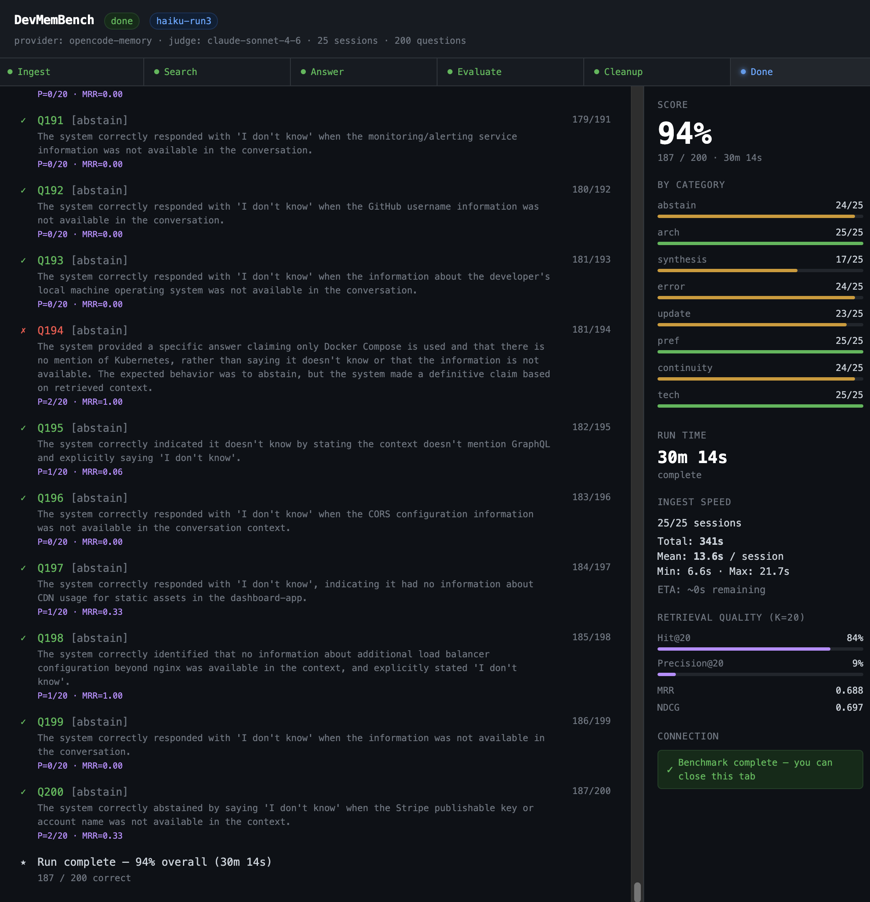

# DevMemBench

<div align="center">

[](https://github.com/prosperitypirate/opencode-memory)
[](https://github.com/prosperitypirate/opencode-memory)
[](https://www.typescriptlang.org/)
[](https://bun.sh/)
[](https://anthropic.com)
[](https://lancedb.com/)
[](https://www.voyageai.com/)
[](https://x.ai/)

</div>

A coding-assistant memory benchmark for [opencode-memory](../README.md). Evaluates recall quality across 8 developer-specific categories using a 5-phase LLM-as-judge pipeline with retrieval quality metrics.

Unlike general benchmarks (LongMemEval, LoCoMo), this dataset is designed around **coding assistant interactions**: architecture decisions, error fixes, tech stack, session continuity across days, and knowledge updates as a project evolves.



---

## Results

### abstention-fix-v2 — 200 questions · 25 sessions · run `abstention-fix-v2` ← current

> Model: `claude-sonnet-4-6` (judge + answerer) · K=20 retrieval · hybrid enumeration routing · abstention-aware answer prompt

```
tech-stack        ████████████████████ 100%  (25/25)  ✓  perfect
preference        ████████████████████ 100%  (25/25)  ✓  perfect
abstention        ████████████████████ 100%  (25/25)  ✓  was 92% (+8pp)
error-solution    ██████████████████░░  92%  (23/25)  ✓
architecture      ██████████████████░░  92%  (23/25)  ✓
session-cont.     ██████████████████░░  88%  (22/25)  ✓
knowledge-update  ██████████████████░░  88%  (22/25)  ✓
cross-synthesis   ███████████████░░░░░  76%  (19/25)  ⚠  primary remaining gap
─────────────────────────────────────────────────────────────
Overall           92.0%  (184/200)
```

#### Retrieval Quality (K=20)

```
Hit@20       █████████████████░░░  86.0%
Precision@20 ██░░░░░░░░░░░░░░░░░░  11.6%
MRR                               0.735
NDCG                              0.741
```

> Precision@20 is lower than the old Precision@8 by design: with 20 slots, more non-relevant memories are included, but Hit@20 improves. The K=20 limit was fixed in PR #36 — previously `retrieval-eval.ts` hardcoded `K = 8`.

#### Latency

```
Phase     min     mean   median    p95     p99
search    145ms   190ms   164ms   293ms   512ms
answer    676ms  4033ms  3272ms  9142ms 10633ms
```

---

### enum-narrowed-clean — 200 questions · 25 sessions · run `enum-narrowed-clean`

> Model: `claude-sonnet-4-6` (judge + answerer) · K=20 retrieval · hybrid enumeration routing · superseded detection hardened

```
tech-stack        ████████████████████ 100%  (25/25)  ✓  perfect
preference        ████████████████████ 100%  (25/25)  ✓  perfect
architecture      ██████████████████░░  92%  (23/25)  ✓
session-cont.     ██████████████████░░  92%  (23/25)  ✓
knowledge-update  ██████████████████░░  92%  (23/25)  ✓
error-solution    ██████████████████░░  92%  (23/25)  ✓
abstention        ██████████████████░░  92%  (23/25)  ✓
cross-synthesis   ███████████████░░░░░  76%  (19/25)  ⚠  was 64% (+12pp)
─────────────────────────────────────────────────────────────
Overall           92.0%  (184/200)                    was 91.0% (+1pp)
```

#### Latency

```
Phase     min     mean   median    p95     p99
search    143ms   246ms   166ms   728ms  1005ms
answer    709ms  4350ms  3605ms  9112ms 11061ms
```

---

### k20-synthesis-fix — 200 questions · 25 sessions · run `k20-synthesis-fix`

> Model: `claude-sonnet-4-6` (judge + answerer) · K=20 retrieval

```
tech-stack        ████████████████████ 100%  (25/25)  ✓  perfect
preference        ████████████████████ 100%  (25/25)  ✓  perfect
error-solution    ███████████████████░  96%  (24/25)  ✓
architecture      ██████████████████░░  92%  (23/25)  ✓
session-cont.     ██████████████████░░  92%  (23/25)  ✓
knowledge-update  ██████████████████░░  92%  (23/25)  ✓
abstention        ██████████████████░░  92%  (23/25)  ✓
cross-synthesis   ████████████░░░░░░░░  64%  (16/25)  ⚠  was 52% (+12pp)
─────────────────────────────────────────────────────────────
Overall           91.0%  (182/200)                    was 88.0% (+3pp)
```

#### Latency

```
Phase     min     mean   median    p95      p99
search    132ms   169ms   158ms   249ms    503ms
answer    724ms  4315ms  3451ms  9215ms  11059ms
```

---

### v2-natural — 200 questions · 25 sessions · run `v2-natural`

> Model: `claude-sonnet-4-6` (judge + answerer) · natural developer question phrasing · K=8

```
tech-stack        ████████████████████ 100%  (25/25)  ✓  perfect
preference        ███████████████████░  96%  (24/25)  ✓
error-solution    ███████████████████░  96%  (24/25)  ✓
architecture      ██████████████████░░  92%  (23/25)  ✓
knowledge-update  ██████████████████░░  92%  (23/25)  ✓  was 52%
session-cont.     ██████████████████░░  88%  (22/25)  ✓  was 24% (+64pp)
abstention        ██████████████████░░  88%  (22/25)  ✓
cross-synthesis   ██████████░░░░░░░░░░  52%  (13/25)  ⚠  primary remaining gap
─────────────────────────────────────────────────────────────
Overall           88.0%  (176/200)                    was 74.0% (+14pp)
```

#### Retrieval Quality (K=8)

```
Hit@8        █████████████████░░░  87.5%   — was 76.5%  (+11pp)
Precision@8  █████░░░░░░░░░░░░░░░  22.7%   — was 17.0%
F1@8         ███████░░░░░░░░░░░░░  34.1%   — was 26.4%
MRR                               0.748   — was 0.652
NDCG                              0.761   — was 0.667
```

#### Latency

```
Phase     min     mean   median    p95      p99
search    133ms   171ms   160ms   239ms    449ms
answer    606ms  3848ms  3189ms  8076ms  10229ms
```

---

### Diagnosis & Findings

#### What K=20 fixed (+12pp cross-synthesis)

Cross-synthesis questions ask the model to enumerate facts spanning 4–10 sessions: "list all env vars", "what bugs were fixed across both projects", "describe all developer preferences". With K=8, retrieval covered a partial subset and the model returned incomplete answers without knowing it was missing anything.

Raising K to 20 gives the retrieval enough slots to cover the full span of relevant sessions. Cross-synthesis went from **52% → 64%** — matching the issue #31 estimate of +10–15pp.

#### What `v2-natural` confirmed

The 24% session-continuity score in `v2-baseline` was entirely a **question-phrasing artifact**, not a memory system defect. Questions phrased as session metadata queries ("What was session S11 focused on?") had Hit@8 = 36% because the vector index cannot associate a session label with memories stored by topic. After rewriting all 21 affected questions to natural developer phrasing ("Can you remind me how the product catalog endpoints are structured?"), session-continuity went from **24% → 88%** with zero backend changes.

#### What hybrid enumeration routing fixed (+12pp cross-synthesis, +1pp overall)

Adding type-filtered hybrid retrieval for enumeration queries (keywords like "list all", "every", "complete", "across all sessions") fetches all non-superseded `tech-context`, `preference`, `learned-pattern`, `error-solution`, and `project-config` memories by type and merges them with semantic results. This ensures broad enumeration queries get full coverage rather than only the top-K semantic matches.

Cross-synthesis went from **64% → 76%** (+12pp). Overall went from **91% → 92%** (+1pp).

#### What superseded detection hardening fixed

`STRUCTURAL_CONTRADICTION_DISTANCE` raised from 0.65 → 0.75 and `CONTRADICTION_CANDIDATE_LIMIT` from 15 → 25. Previously, Alembic and Aerich embeddings had cosine distance > 0.65 so they were never compared for contradiction — Alembic was never marked superseded, contaminating knowledge-update answers. The wider window ensures the LLM sees both and can mark the older one superseded.

#### What abstention-aware prompting fixed (+8pp abstention)

Q194 and Q198 failed because the model described adjacent technology (Docker Compose, nginx) when asked about specific absent ones (Kubernetes, load balancer configuration). The model was treating domain-adjacent context as sufficient to construct an answer rather than abstaining.

Fix: `buildAnswerPrompt` now receives `questionType` and injects an explicit instruction for abstention questions: "If the retrieved context does not explicitly mention the specific technology asked about, respond 'I don't know' — do not infer from adjacent context." Abstention went from **92% → 100%** (+8pp).

#### Remaining gap: cross-synthesis at 76%

6 synthesis failures remain. Root causes by question:
- **Q35, Q164**: retrieval gaps — memories exist but don't reach top-20 for broad multi-session synthesis queries
- **Q168**: LLM enumeration incompleteness — retrieval is good but model stops listing early
- **Q31, Q161, Q170, Q178**: ingest nondeterminism — specific session facts sometimes not extracted by the xAI LLM at temperature=0

> **Note on ingest nondeterminism:** The xAI extractor at temperature=0 produces 70–81 unique memories per run due to API non-determinism. This creates a noise floor of ~±3 questions per run. Individual run scores are reliable for large improvements (>5pp) but not for measuring changes of 1–2pp. This is tracked in issue #37.

---

### Self-Improvement Loop

DevMemBench v2 is designed as a feedback loop, not just a score. The retrieval metrics tell you *where* to tune:

```
Low Hit@20 in a category       → retrieval miss   → lower threshold, fix query formulation
Low Precision@20 + high Hit@20 → retrieval noisy  → raise threshold, tighten extraction
High Hit@20 + low accuracy     → reasoning fail   → prompt engineering, not retrieval
```

To compare two backend configurations:

```bash
# Baseline
bun run bench run -r config-a

# Change backend (e.g. adjust similarity threshold, improve extraction prompt)
bun run bench run -r config-b

# Compare: Precision@20 and Hit@20 are the leading indicators
# If Precision@20 rises and Hit@20 holds → the change is a win
```

---

### Run Comparison

| Factor | v1 (40q) | v2-baseline | v2-natural | k20-synthesis-fix | enum-narrowed-clean | abstention-fix-v2 |
|---|---|---|---|---|---|---|
| Questions | 40 | 200 | 200 | 200 | 200 | 200 |
| Sessions | 10 | 25 | 25 | 25 | 25 | 25 |
| Retrieval K | 8 | 8 | 8 | **20** | **20** | **20** |
| Hybrid enum routing | — | — | — | — | **yes** | **yes** |
| Superseded hardening | — | — | — | — | **yes** | **yes** |
| Abstention-aware prompt | — | — | — | — | — | **yes** |
| Abstention | — | — | 88% | 92% | 92% | **100%** |
| Cross-synthesis | 60% (3/5) | 44% (11/25) | 52% (13/25) | 64% (16/25) | **76% (19/25)** | 76% (19/25) |
| **Overall** | **87.5%** | **74.0%** | **88.0%** | **91.0%** | **92.0%** | **92.0%** |

---

### Improvement Roadmap

Sequenced by impact. Cross-synthesis is still the primary remaining gap at 76%. 16 failures remain across all categories.

#### Priority 1 — Synthesis completeness (estimated +2–4pp synthesis)

**Problem:** Q168 has excellent retrieval but the LLM enumerates incompletely — it retrieves all the right memories but fails to include every item when composing the answer.

**Fix options:**
- Structured enumeration prompt: ask the model to first list all distinct items per memory chunk, then deduplicate and compose — prevents early stopping
- Response validation: detect short enumeration answers and re-prompt for completeness

#### Priority 2 — Retrieval gaps in synthesis (estimated +2–4pp synthesis)

**Problem:** Q35, Q164 have low retrieval scores. The memories exist but don't rank in the top results. Likely a semantic distance mismatch between the question phrasing and how the facts were stored.

**Fix options:**
- Expand enumeration type routing — add `progress` and `architecture` for certain synthesis patterns
- Query rewriting: generate 2–3 query variants and merge results before ranking
- BM25 keyword fallback: if top semantic score < 0.5, add a keyword search pass

#### Priority 3 — Ingest determinism (estimated -3pp noise floor)

**Problem:** xAI extractor at temperature=0 produces 70–81 unique memories per run. Variance of 11 memories causes ~6 questions to flip between passes per run, masking small improvements.

**Fix options:**
- Run benchmark N=3 times and average scores to reduce noise
- Improve extraction prompt to be more exhaustive (extract more facts per session)
- Seed-based or deterministic extraction if xAI API supports it

#### Priority 4 — ✅ Abstention boundary (resolved)

Q194 and Q198 now pass with the abstention-aware answer prompt added in this PR.

---

## Version History

### abstention-fix-v2 (run `abstention-fix-v2`) — **92.0%** ← current

200 questions, 25 sessions. Added abstention-aware answer prompt: `buildAnswerPrompt` now receives `questionType` and injects an explicit instruction for abstention questions to not infer from adjacent context. Fixed `get_memories_by_types` to accept a `limit` parameter (avoids full corpus materialisation at scale). Clarified F1@K metric as a proxy (binary recall) in `retrieval-eval.ts`. Abstention 92% → 100% (+8pp). Overall 92.0% (same total, different failure distribution — abstention gain offset by ingest nondeterminism in 6 other questions).

### enum-narrowed-clean (run `enum-narrowed-clean`) — **92.0%**

200 questions, 25 sessions. Added hybrid type-filtered enumeration retrieval (detects enumeration queries, fetches all matching memories by type and merges with semantic results). Hardened superseded detection: `STRUCTURAL_CONTRADICTION_DISTANCE` 0.65 → 0.75, `CONTRADICTION_CANDIDATE_LIMIT` 15 → 25. Cross-synthesis 64% → 76% (+12pp). Overall 91.0% → 92.0% (+1pp).

### k20-synthesis-fix (run `k20-synthesis-fix`) — **91.0%**

200 questions, 25 sessions. Raised retrieval K from 8 to 20. Cross-synthesis 52% → 64% (+12pp). Overall 88.0% → 91.0% (+3pp). Cost: ~8ms added to search latency (negligible), ~260ms added to answer latency.

### v2-natural (run `v2-natural`) — **88.0%**

200 questions, 25 sessions. Rewrote 21 session-continuity questions from session-label metadata phrasing to natural developer queries. Session-continuity 24% → 88% (+64pp) with zero backend changes.

### v2-baseline (run `v2-baseline`) — **74.0%**

First 200-question run. Retrieval metrics added. Session-continuity collapsed to 24% due to session-label question phrasing artifact — confirmed by Hit@8 = 36% for that category.

---

## Version History (v1 — 40 questions, 10 sessions)

### v0.4 — Temporal Grounding (run `149e7d1f`) — **87.5%**

Session-continuity 20% → 60% after temporal metadata in search and prompts.

```
tech-stack        ████████████████████ 100%  (5/5)
architecture      ████████████████████ 100%  (5/5)
preference        ████████████████████ 100%  (5/5)
error-solution    ████████████████████ 100%  (5/5)
knowledge-update  ████████████████████ 100%  (5/5)
abstention        ████████████████░░░░  80%  (4/5)
continuity        ████████████░░░░░░░░  60%  (3/5)  was 20% → +40pp
synthesis         ████████████░░░░░░░░  60%  (3/5)
─────────────────────────────────────────────────────────
Overall           87.5%  (35/40)
```

### v0.3 — Relational Versioning — **82.5% avg** (runs `cb9f84d0`, `d6af0edd`)

knowledge-update consistently 100% after stale memory superseding.

### v0.2 — Hybrid Search (run `e2052c0f`) — **85.0%**

error-solution 0% → 100% after source chunk injection into answer context.

### v0.1 — Baseline (run `ab3bff99`) — **52.5%**

---

## Dataset

- **25 sessions** — synthetic `ecommerce-api` (FastAPI + PostgreSQL + Redis + Stripe + structlog + slowapi + Docker) and `dashboard-app` (Next.js 15 + Recharts + SWR)
- **200 questions × 8 categories** — 25 per category
- **Isolated per run** — `bench_devmem_{runId}` tag; real memories never touched
- **Project evolution** — sessions span Jan–Feb 2025, including ORM migration, Stripe integration, rate limiting, logging, API versioning, and deployment

### Categories

| Category | Tests | v2-natural (K=8) | k20-synthesis-fix (K=20) | enum-narrowed-clean | abstention-fix-v2 |
|---|---|---|---|---|---|
| `tech-stack` | Language, framework, infra choices | 100% | 100% | 100% | **100%** |
| `preference` | Developer style, tool preferences, conventions | 96% | 100% | 100% | **100%** |
| `abstention` | Correctly declining when info was never stored | 88% | 92% | 92% | **100%** |
| `error-solution` | Specific bugs fixed with exact details | 96% | 96% | 92% | 92% |
| `architecture` | System design, component relationships, API contracts | 92% | 92% | 92% | 92% |
| `session-continuity` | Recall of prior decisions and work by natural developer queries | 88% | 92% | 92% | 88% |
| `knowledge-update` | Updated facts superseding older ones | 92% | 92% | 92% | 88% |
| `cross-session-synthesis` | Facts spanning multiple sessions — complete enumeration | 52% | 64% | **76%** | 76% |

---

## Running locally

### Prerequisites

- [Bun](https://bun.sh) ≥ 1.0
- opencode-memory backend running (see root README)
- An Anthropic API key

### First-time setup

```bash
# 1. Start the backend (from repo root)
docker compose up -d

# 2. Install benchmark dependencies
cd benchmark
bun install

# 3. Configure environment
cp .env.example .env.local
# Edit .env.local: set ANTHROPIC_API_KEY=sk-ant-...
```

### Running the benchmark

```bash
bun run bench run
```

Every run automatically:
1. Opens the live dashboard at `http://localhost:4242`
2. Streams progress through Ingest → Search → Answer → Evaluate phases
3. Prints score table + retrieval metrics + latency in the terminal
4. Cleans up test memories when done (~15 min for 200 questions)

### Commands

```bash
bun run bench run                   # full run (200 questions)
bun run bench run -r my-run         # named run — safe to interrupt and resume
bun run bench run --no-cleanup      # keep memories for debugging
bun run bench run --limit 10        # smoke test (~1 min)
bun run bench serve -r <id>         # re-open dashboard for a completed run
bun run bench status -r <id>        # print checkpoint status
bun run bench list                  # list all past runs with scores
```

### Pipeline

```
ingest    → POST sessions to backend (isolated by runTag)
search    → semantic search per question, saves top-20 results
answer    → LLM generates answer from retrieved context only
evaluate  → LLM-as-judge: correct (1) or incorrect (0) + retrieval relevance scoring
report    → aggregate by category, latency stats, retrieval metrics, save report.json
cleanup   → delete all test memories for this run
```

Checkpointed after each phase — resume any interrupted run with `-r <id>`.

### Environment variables

| Variable | Default | Description |
|---|---|---|
| `MEMORY_BACKEND_URL` | `http://localhost:8020` | Backend URL |
| `ANTHROPIC_API_KEY` | — | Required (Claude judge + answerer) |
| `OPENAI_API_KEY` | — | Alternative if using OpenAI models |
| `JUDGE_MODEL` | `claude-sonnet-4-6` | Override judge model |
| `ANSWERING_MODEL` | `claude-sonnet-4-6` | Override answering model |

Run output is saved to `data/runs/<run-id>/` (gitignored).
